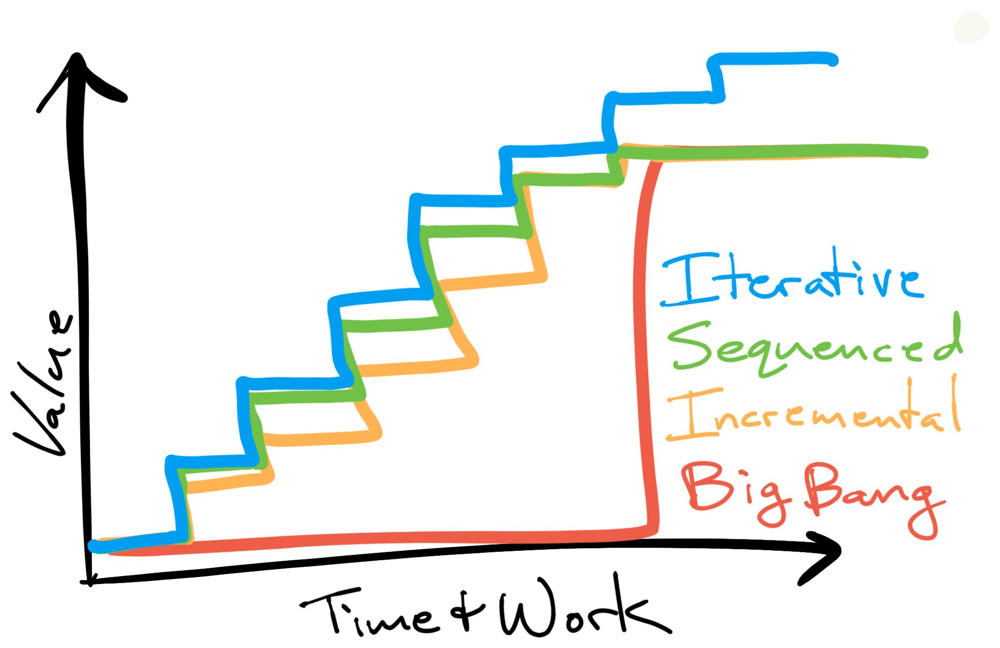

# Scrum Deconstructed

We've all had some experience with Scrum

I don't know that I've ever seen a team follow it to the letter.

Scrum is a lightweight framework.

The whole thing is short and [available online](https://scrumguides.org/scrum-guide.html).

It's not the only way to be Agile and there are many beneficial ways to adapt or modify it.

The majority of the modifications I've seen have been detrimental and have been premature optimizations.

What matters the most?

## Values

Scrum includes a set of roles, artifacts, and events.

You can schedule the events, name some artifacts, and give people titles that match the roles, and still get zero benefit.

Scrum requires a self-managing team, defined as:

> The team is responsible for executing the tasks **and** monitoring and managing process and progress.

Self-management entails freedom *and* responsibility.

Self-management requires a certain mindset among the team and the organization around the team.

Commitment 
⬆️ Focus 
⬆️ Openness 
⬆️ Courage 
⬆️ Respect

### ✍️ Commitment

To self-management. To the goals and each other. The lynch-pin of Scrum: commitment removes hesitation and propels the team.

Builds upon Focus.

Note: It is up to the team to make progress and enforce the process. Relates to Ownership.

### 🔭 Focus

Align as a team to make the best progress toward the most valuable goal.

This focus comes from agreement built upon Open engagement.

Note: The artifacts inform where to focus.

### 🪟 Openness

Make things visible, inspectable, available to all.

This requires Courage.

### 🦁 Courage

Speak truth to power, do the right thing, make improvements, and tackle difficult work.

Courage is cultivated and sustained by Respect.

Note: Ownership

### 🤝 Respect

Value the expertise and responsibility of everyone, particularly the self-managing team.

Note: Kindness

The lack of any of these values can undermine the success of a Scrum team.

## 💠Transparency 🔠Inspection 🦠 Adaptation

### 💎 Transparency

- Make visible what matters (the work, product, plans, emergent process, etc.) to those doing the work and those receiving it.
- Requires openness and psychological safety for real transparency.

### 🔍 Inspection

- Examine work/product/plans/process/etc. in order to understand and inform decisions.
- Requires transparency.
- Kindness and blamelessness enable a deeper and truer understanding of contributing factors.

### 🦠 Adaptation

- Change the work/product/plans/process/etc. immediately/ASAP to better achieve goals.
- Must be informed by inspection.
- Ownership, empowerment and self-management enable adaption.

💎🔍🦠

"Inspect & Adapt" is the core of Scrum.

## Artifacts, Events, and Roles

Three artifacts for transparency:

<strong>Artifact</strong>

<strong>Makes Visible</strong>

Product Increment

📦 the product

Product Backlog

📅 the medium-term plan

Sprint Backlog

🕠the short-term plan

Four events to inspect & adapt:

<strong>Event</strong>

<strong>Inspects & Adapts</strong>

Sprint Review

📦 the product

Sprint Planning

📅 the medium-term plan

Daily Scrum

🕠the short-term plan

Sprint Retrospective

🌠any & everything

Three roles to accomplish this:

<strong>Role</strong>

<strong>Focus</strong>

Product Owner

📶 Maximizing Value

Developers

🥇 Quality Work

Scrum Masters

🉠Team Effectiveness

## The Sprint

The sprint is a timebox.

- **Fixed-length** time period
- **Arbitrary** relative to the scope of work
- **Short** for frequent inspection and adaptation (product, plans, process, etc.)

Software is complex: small changes can have huge and hard-to-predict consequences.

Estimating complex work is frequently misleading and dangerous.

Note: Estimating the time required to develop software has an incredibly bad track record and is responsible for many death marches and failed projects.

Scrum is founded on empiricism. The guide calls out the limits of forecasting:

> In complex environments, what will happen is unknown. Only what has already happened may be used for forward-looking decision making.

<!-- .slide: data-background-image="https://sep.yimg.com/ca/I/tavernpuzzles_2272_7242125" data-background-size="contain" data-background-color="white" -->
Note:  this puzzle is not even complex, but it contains unknowns even though fully inspectible. Your estimate is likely wildly inaccurate until you've actually solved it. I can remove the U-shaped shuttle in a little under a minute, but it took me many hours over several months to solve it the first time.

There are useful forecasting techniques that are based in historical data, such as burn-up charts, cumulative flow diagrams, and Monte Carlo simulations.

Fundamentally, however, the only certain thing is the working software.

## Product Increment

"Potentially Shippable Product Increment"

Note: This is used when designing embedded systems and software that will be pressed onto CDs and shipped. This idea comes out of the 90's and is not based in SaaS or DevOps. This doesn't mean that you actually ship, but that you've achieved something of that level of quality and integration that can be inspected.

How frequently do you have a fully-functional and fully-tested version that is ready to ship?

Holding costs:

- Risks are hidden in between these points.
- Waste occurs while people are unaware of the pending differences.
- Options are limited between these points given the remaining effort to become shippable.

A potentially shippable product increment takes extra effort:

Transaction costs:

- Small chunks of work that can be completed within a Sprint.
- Frequent integration of code.
- Frequent testing.

<!-- .slide: data-background-image="https://i.stack.imgur.com/j5rF8.jpg" data-background-size="contain" data-background-color="white" -->
Note:  It is human nature to notice the transaction costs because they are immediate: we see and feel them in the moment. The holding costs are removed from the event. Lean and just-in-time manufacturing were competitive advantages because they reduced holding costs. Not shown here, holding costs can actually jump at various points as you cross threshholds, such as food spoilage, needing another warehouse, etc.

Small batches of work is one of the key insights of Agile software development and is the result of many scars.

The Product Increment is supposed to be inspected at a minimum at the Sprint Review which should generate feedback that informs Sprint Planning.

## Product and Sprint Backlogs

Value flow over individual work.

<strong>Value</strong>

<strong>Work</strong>

Trimmed lawn

Pushing a mower

Pain-free mobility

Knee surgery

Finding vulnerabilities in Go packages

Writing code

Note: When you focus on value, you can start noticing better ways to achieve it. Riding mower? Robo-mower? Naturally short ground-cover?

Each person being busy is a very bad proxy for the total delivery of value.

In fact, busy workers can be detrimental to effective value delivery.

Taylor's scientific management expected managers to determine how best to deliver value and for workers to follow practices and procedures.

Scrum expects the self-managing team to organize around delivering value.

"What should I work on?"

Answer: whatever best contributes to the *team* delivering the most *value*.

The Product Backlog is intended to be a force-ranked list of value to deliver.

There can be many factors involved involved in that ranking.

Uncertain and risky items, for example, should move to the top in order to reduce risk early.

Kanban focuses on continuous flow and reducing the time required for each item.

Scrum takes on small batches (Sprint Backlog) to be completed in short timeboxes (the Sprint).

Note: These can be mixed and there are other approaches too.

The Sprint Backlog should be based on a Sprint Goal

Knowing *why* informs the team and allows them to better determine *how* to do so.

It opens the door for re-negotiating in order to deliver better value.

The Sprint Backlog is the *plan* for accomplishing the Sprint Goal.

It is created initially at each Sprint Planning.

The Daily Scrum is for the team to adjust the plan and their activity to better accomplish the Sprint Goal.

"What should I work on?"

How do you feed a family? How do you balance buying groceries, cooking, eating, cleaning up, and doing dishes?

The answer is highly dependent on the context and the self-managing team is expected to work together to figure it out.

<strong>Product Owner</strong>

<strong>Developers</strong>

Product Backlog Sprint Goal

Sprint Backlog Product Increment

## Agile/Lean Value Delivery

> Increment, sequence, and iterate in order to avoid costs, mitigate risks, and accrete value.
Note: from discussions with and presentations by Ken Furlong

Incremental

Sprints and Increments

Sequenced

Product Backlog

Iterative

Inspect and Adapt

<!-- .slide: data-transition="slide none" data-background-transition="slide none" data-background-color="white" -->

<!-- .slide: data-transition="none" data-background-transition="none" data-background-color="white" -->

<!-- .slide: data-transition="none" data-background-transition="none" data-background-color="white" -->

<!-- .slide: data-transition="none" data-background-transition="none" data-background-color="white" -->

<!-- .slide: data-transition="none" data-background-transition="none" data-background-color="white" -->

<!-- .slide: data-transition="none" data-background-transition="none" data-background-color="white" -->

## Take-Aways

1. Values & Self-Management
2. Transparency, Inspection, and Adaptation
3. Small Batches (Increment)
4. Ordered (Sequence)
5. Learn and Respond (Iterate)
6. Accelerate and Amplify Feedback Loops
7. Maintain Stable Intermediary States
