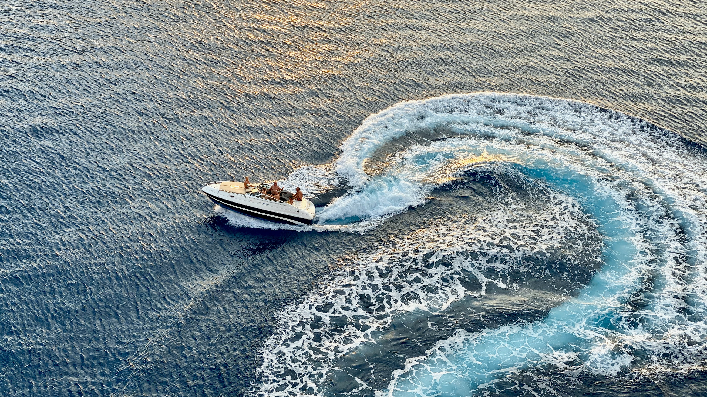
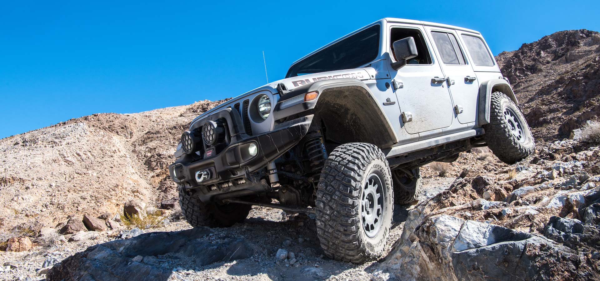
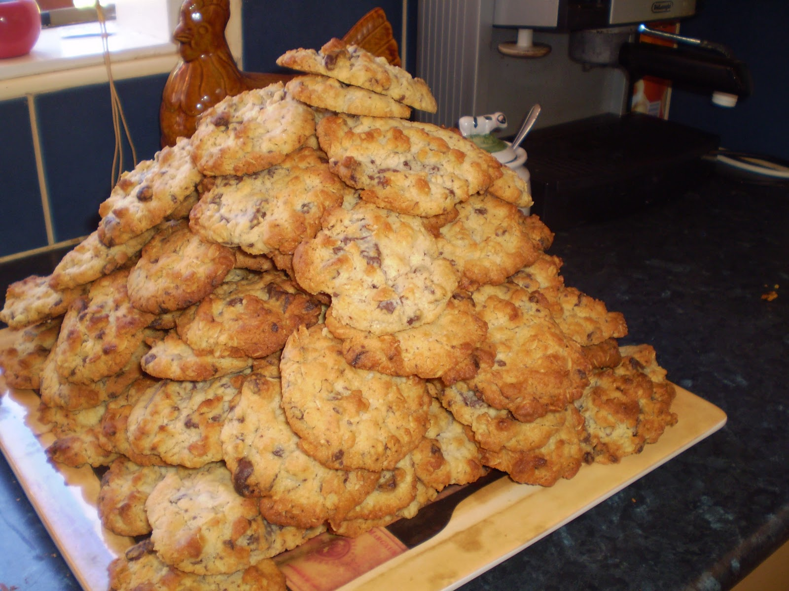
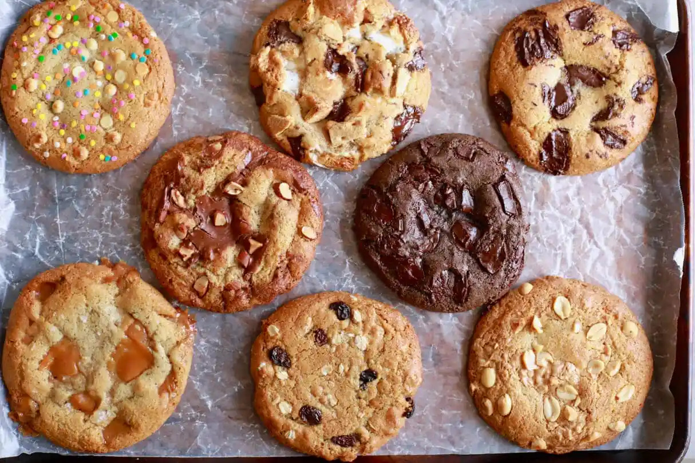

# Small Batches

---

Efficiently deliver to a well-known target.

Effectively explore and adjust rapidly.

--

Efficiently deliver to a well-known target.

Effectively explore and adjust rapidly.

--

Large Batch 

Small Batch 

Efficiently deliver to a well-known target.

Effectively explore and adjust rapidly.

---

## Costs: Transaction and Holding

<!-- .slide: data-transition="slide none" data-background-transition="slide none" data-background-color="white" -->

--

<!-- .slide: data-transition="slide none" data-background-transition="slide none" data-background-color="white" -->

--

<!-- .slide: data-transition="slide none" data-background-transition="slide none" data-background-color="white" -->

--

<!-- .slide: data-transition="slide none" data-background-transition="slide none" data-background-color="white" -->

--

<!-- .slide: data-transition="slide none" data-background-transition="slide none" data-background-color="white" -->

--

<!-- .slide: data-transition="slide none" data-background-transition="slide none" data-background-color="white" -->

--

<!-- .slide: data-transition="slide none" data-background-transition="slide none" data-background-color="white" -->

--

<!-- .slide: data-transition="slide none" data-background-transition="slide none" data-background-color="white" -->

