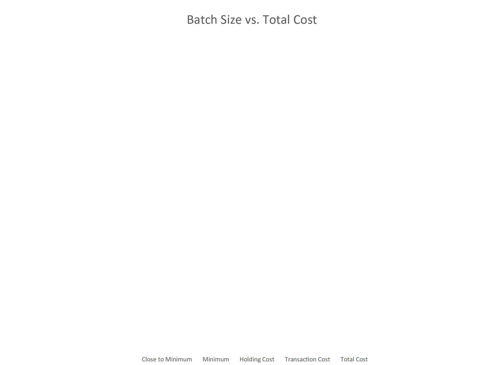
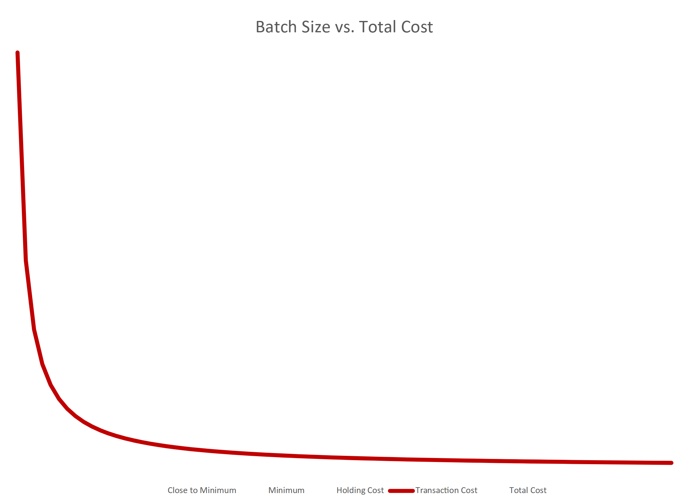
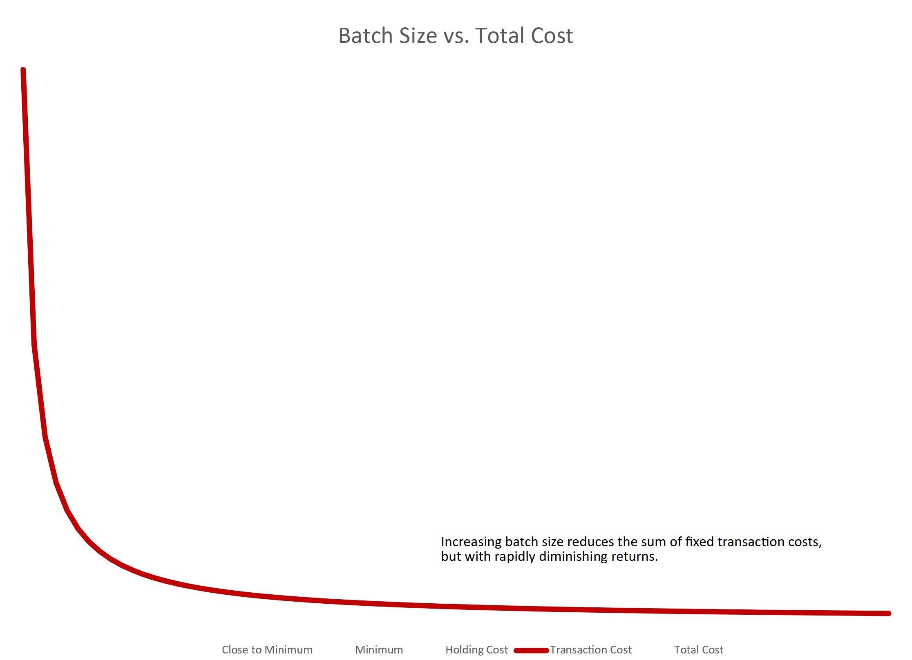
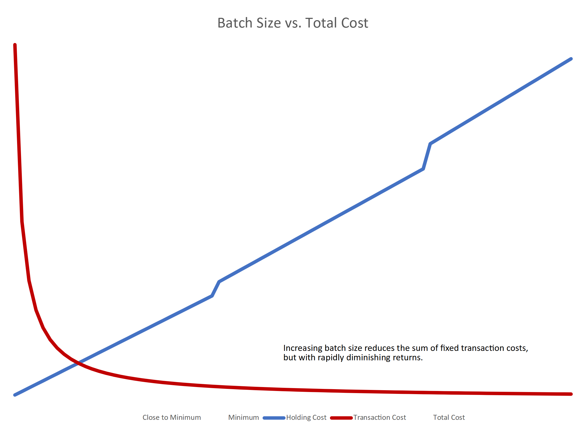
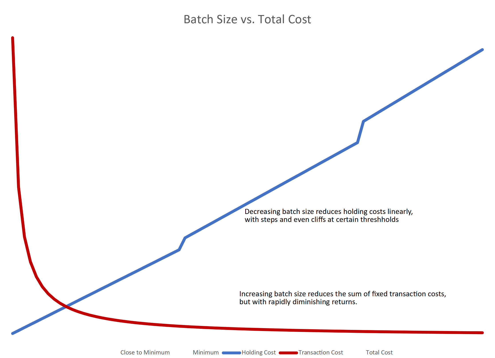
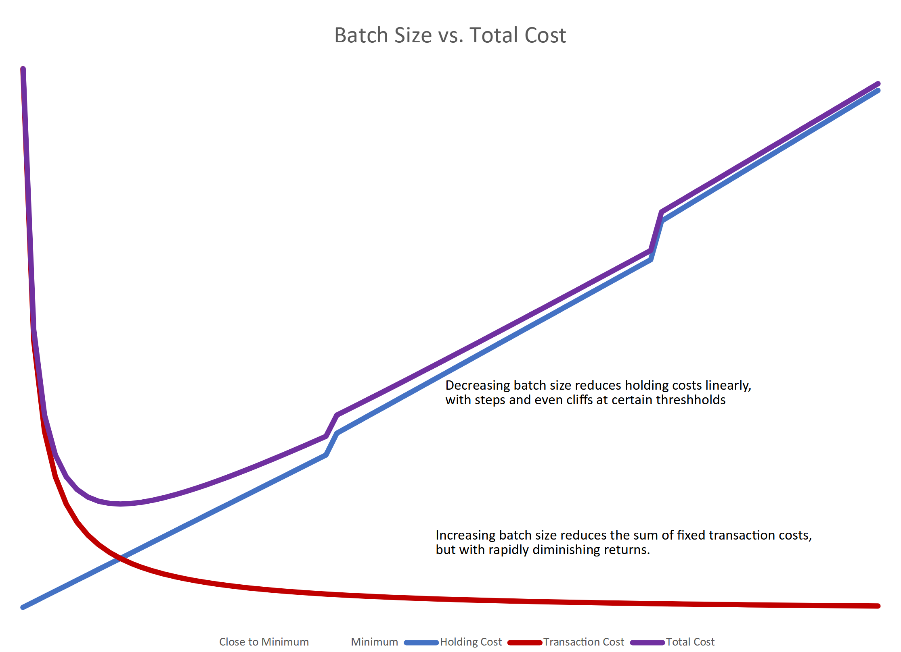
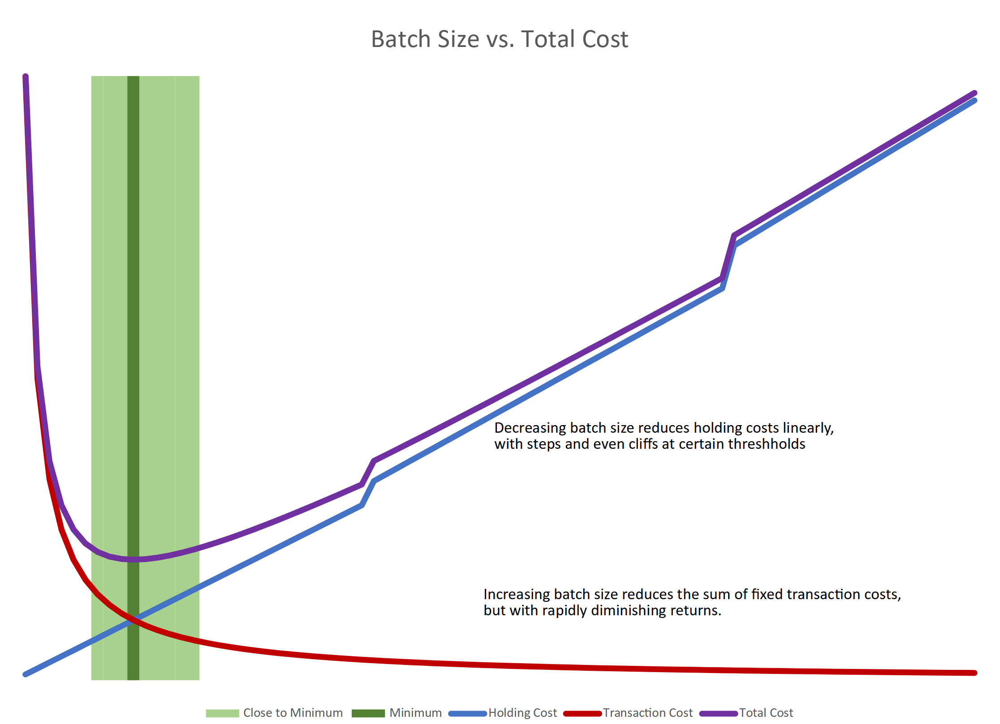
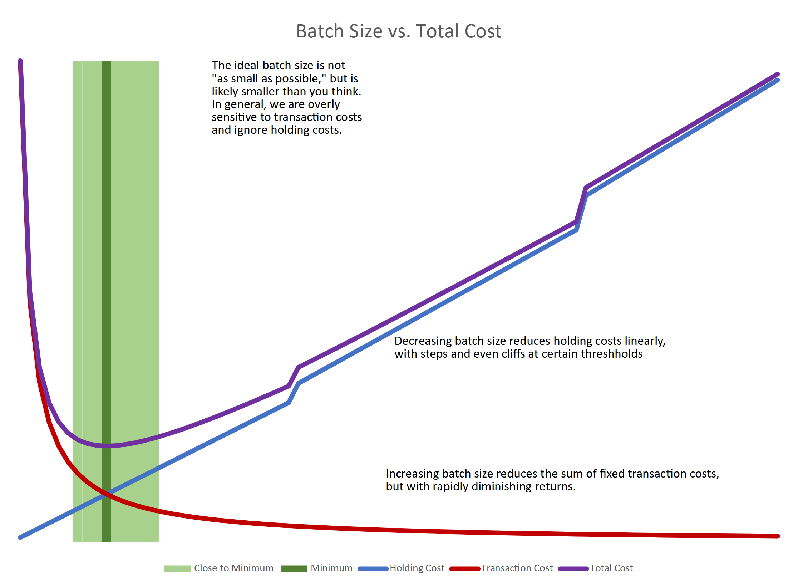

# Small Batches

---

<!-- .slide: data-transition="slide none" data-background-transition="slide none" data-background-color="white" -->

--

<!-- .slide: data-transition="slide none" data-background-transition="slide none" data-background-color="white" -->

--

<!-- .slide: data-transition="slide none" data-background-transition="slide none" data-background-color="white" -->

--

<!-- .slide: data-transition="slide none" data-background-transition="slide none" data-background-color="white" -->

--

<!-- .slide: data-transition="slide none" data-background-transition="slide none" data-background-color="white" -->

--

<!-- .slide: data-transition="slide none" data-background-transition="slide none" data-background-color="white" -->

--

<!-- .slide: data-transition="slide none" data-background-transition="slide none" data-background-color="white" -->

--

<!-- .slide: data-transition="slide none" data-background-transition="slide none" data-background-color="white" -->

