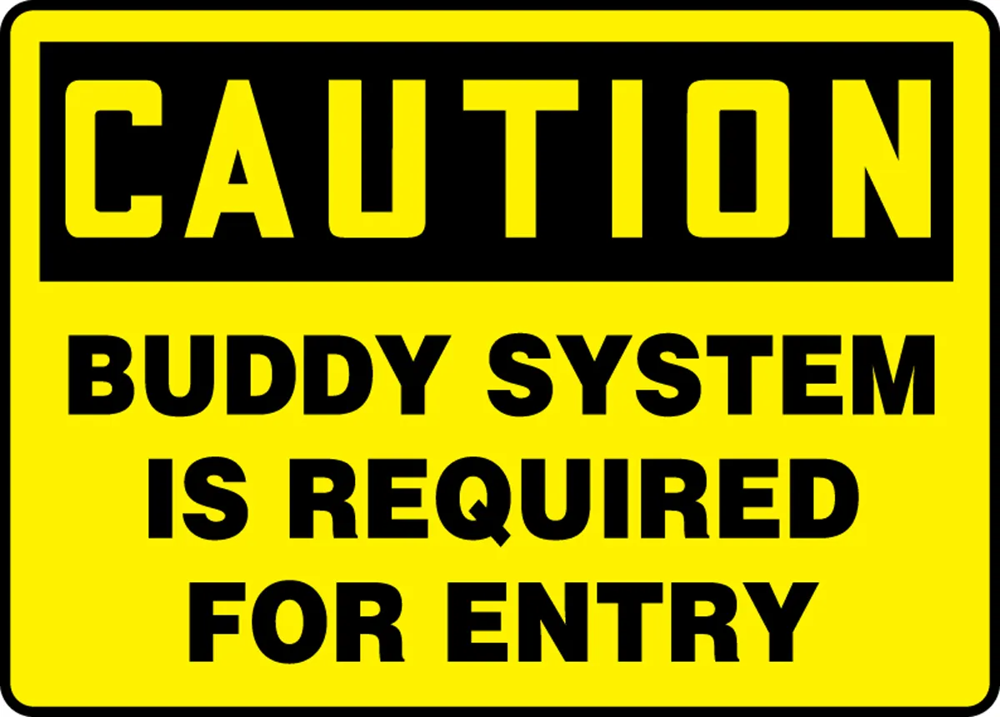
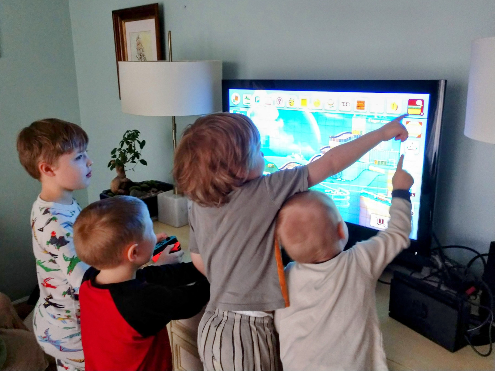

# The Undercover Scrum Master Returns

Note: TODO

## Intro & Assumptions

Note: 0:00 Intro & Assumptions

### Dane's undercover mission

Note: TODO

#### Previous Experience

- Philosophy & Clinical Psychology
- Business Analysis, Support, Account Ownership
- Product Owner & Scrum Master
- Agile Coach

Note: TODO
The leadup to my undercover mission. Narrate.
Psychology -> Custom Software world -> Discovered Scrum and Agile -> wanted to coach on development practices

#### The Mission

🟥E-Verify⬜

🐳 Big Sillies
🦊 Faux Pas
👾 Bits, Please!

Note:
- Worked with a high-performing set of teams
- where we were able to have fun, name our teams
- We experimented and looked for ways to improve
- The project was characterized by egalitarian, joyful, empowered, and helpful people
- Was really surprised by what I learned from the experience

#### The Return

- Technical Agile Coach
- Engineering Manager
- Software Developer (again)

Note:
Since then I've sought out opportunities to participate in sofware development from micro to macro, writing code to organizational design.
Unfortunately, most jobs and roles are designed to box you in, so I keep looking for roles that allow me to develop my technical skills while also having the opportunity to improve the work environment.

### Baseline Assumptions

#### Agile Manifesto

Agility > ~Efficiency~

Note: TODO
While I'm more than happy to discuss the Agile Manfesto, I'm going to speak as though we're all already on-board with it.

#### Humanity and being humane

Note: TODO
I want the workplace to be humane. I'm not interested in helping anyone exploit workers.

#### Sustainable pace

Note: TODO
Same deal, but here I'll speak to this later on. I'm personally biased in favor of a reasonable work-week approached thoughtfully. I believe that's also how to develop the best software, but I'm definitely biased in favor.

## Crossing the Technical Divide

Note: 0:06 Crossing the Technical Divide

You don't need to spend two years programming.

Note: TODO
If you don't consider yourself technical, I want to encourage you to bravely work with your colleagues regardless of expertise. I certainly gained valuable insight and a lot of confidence by engaging in software development myself, but in retrospect I don't believe it was necessary.

### Keys

Collegiality -> Empathy -> Curiosity -> Advocacy -> Challenge

Note: TODO
Here's my bottom-line for this presention.
When approaching your technical colleagues, I'm hoping you can develop these traits and skills.
You could add "technical" to each of these terms if you like.

## Collegiality

Note: 0:08 Collegiality

collegiality

1. working with colleagues in an effective and cooperative manner
2. power and authority that is shared among peers

Note:
By this I mean that you should treat software developers and other folks engaged in technical jobs as your peers.
https://en.wiktionary.org/wiki/collegiality

Muggles vs Wizards (Technical Mysticism)

Note: TODO
(Story of being treated like a "developer" in my first month.)

Programmers are architects, not crane operators

Note: TODO
Conversely, countless times I've been asked

Naming is hard, but words matter

Note: TODO

Equality & Mutual Respect

Note: TODO
Proposal: treat your technical colleagues as equals and with respect.

Caring about the same thing: racing team

Note: TODO
* If you consider a professional racing team, you'll see that the driver and the pit crew are all working toward the same goal.
* They're all professionals, and they all care about the same thing.

ACTIVITY:

write out one thing you can change that you've done in the past to reinforce the technical divide.

Leave it for me at the end of the talk.

Note: 0:18
TODO

## Empathy

Note: 0:20 Empathy

empathy

1. Identification with or understanding of the thoughts, feelings, or emotional state of another person.
2. Capacity to understand another person's point of view or the result of such understanding.

Note:
https://en.wiktionary.org/wiki/empathy

Understanding the programmers

Note: TODO
Story: as a scrum master I assumed the best of the members of my team, but I had a hard time understanding some of their preferences and behaviors. Why weren't they more excited about digging into our process and improving how we worked together? They seemed to want to just get on with the work.

Cognitive load and all the tech required

Note: TODO

The joy of code

Note: TODO

ACTIVITY:

Create the longest word you can, such that you can repeatedly remove a single letter and still have an English word.

For example:
* chat
* cat
* at
* a

Note: 0:28 - 0:31

ACTIVITY: riddle (8 letters; like chat, cat, at, a)

Answer is starting, staring, string, sting, sing, sin, in, i

Note:
TODO

Thinking vs. typing

Note: 0:31 Thinking vs. typing
TODO

Feedback loops

Note: TODO

## Curiosity

Note: 0:34 Curiosity

curiosity

1. the tendency to ask and learn about things by asking questions, investigating, or exploring.

Note:
https://en.wiktionary.org/wiki/curiosity

Don't be afraid

Note: TODO
If you're involved in running a restaurant, you don't have to be a chef to be curious about the food, the techniques, the equipment, etc.

Look at the code and ask about it

Note: TODO

ACTIVITY:

Read some code.

Note: 0:36 - 0:44

ACTIVITY: read tests and sample code that has well-named variables and methods. Discuss at tables to make sense of it. Objective: take a step toward
overcoming fear.

TODO

Growth mindset and the cross-bar of the T

Note: TODO

Layers of an onion: you don't have to be an expert to appreciate and learn about - another layer

Note: TODO

Learn to draw the architecture

Note: TODO

## Advocacy

Note: 0:46 Advocacy

advocacy

1. The act of arguing in favour of, or supporting someone or something.
2. The practice of supporting someone to make their voice heard.

Note:
https://en.wiktionary.org/wiki/advocacy

Do more, faster

Note:
- Story of not having time to "do it right" because the sprint was almost over.

### Draw attention to quality, not just feature delivery

More, faster metrics:

- Velocity
- Cycle Time
- Deadlines

Note:
These certainly aren't perfect, but they definitely draw attention to getting things done.

Morale metrics:

- Niko niko
- Employee Net Promoter Score (NPS)
- Engagement and enablement surveys

Note:
Also far from perfect, and they can be meaningless or abused, but they draw attention to the work environment.

Code quality metrics:

- Count of TODO comments in the code
- Code smells
- Test coverage

Note:
- These are each terrible metrics that invite gaming the system to make the metrics look good.
- Just like the other kinds of metrics, they're much better as a tool for the team to use rather than for management.
- BUT, the presence of one of these metrics brings attention to investing in code quality.
- It also gives the people working on the code an easy way to tie their code quality investments to a metric others ostensibly care about.

Dane's advice:

> Balance out metrics that focus on "more, faster!" with ones that focus on morale and on code quality.

Software is weird.

1. The code is great.
2. Everything else changes.
3. The code is unchanged.
4. The code is now broken or useless.

Code doesn't rot or wear out like physical objects. So how does this happen?

Note:
- Story about (USCSF) great, well-written code from three years ago.
- Used the then-current versions of frameworks and libraries.
- App available in the Play Store.
- Unchanged, the app fell behind the requirements and was delisted.
- Upgrading took many weeks of a team to fully upgrade and relist.
- There wasn't anything wrong three years ago.
- What went wrong was that the world changed and the app was left standing still.

Red queen problem

> Now, here, you see, it takes all the running you can do, to keep in the same place.

-- Lewis Carroll, _Through the Looking-Glass_

Note:
en.wikipedia.org/wiki/Red_Queen_hypothesis

The "home" metaphor for a codebase

Note: TODO
"All models are wrong, but some are useful"

Investment in maintenance, remodeling, and more

Note: TODO
* Red Queen -- at that moment in time, everything was in good shape.
  * Sin
* TCO (Total Cost of Ownership)
* Slides with story of rebuild
* Slides with proposed stable team maintaining and extending

Testing (so many kinds!)

Note: TODO

Automation for team happiness

Note: TODO
"Developer Experience"
Simplicity, Flow

ACTIVITY: brief discussions in groups of 3 or 4 about who currently advocates - for improving technical practices, quality, and automation on your team.

Note: 0:56 - 1:00
ACTIVITY: brief discussions in groups of 3 or 4 about who currently advocates - for improving technical practices, quality, and automation on your team.

TODO

## Challenge

Note: 1:00 Challenge

challenge

1. x
2. x

Note:
https://en.wiktionary.org/wiki/challenge

If it hurts, do it more frequently; move toward "continuous"

Note: TODO

TDD, even if you don't do TDD

Note: TODO

Code is for people; is it readable?

Note: TODO

Pair program, regardless of the terms

Note: TODO

Buddy System

Take your place in the mob

Note: TODO

Social skills are key: software projects are people projects.

Note: TODO
