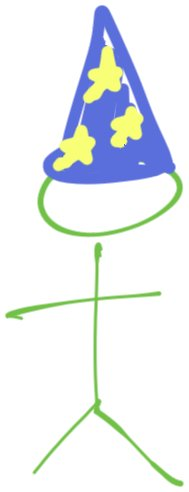

<!-- .slide: data-background-image="cache/Agile2023-first-slide.jpg" data-background-size="contain" data-background-color="white" -->

<!-- .slide: data-background-image="cache/Agile2023-talk-title-slide.jpg" data-background-size="contain" data-background-color="white" -->

# The Undercover Scrum Master Returns

Note:
To generate the PDF, open the presentation in Chrome, appending `?print-pdf` to the URL, and then print to PDF. Make sure to include background graphics.

## Dane's undercover mission

Note:
My path has been a bit unusual, which is why I'm up here to share my story with you.

### Prior Operations

<ul>
<li class="fragment">Philosophy & Clinical Psychology</li>
<li class="fragment">Business Analysis, Support, Account Ownership</li>
<li class="fragment">Product Owner & Scrum Master</li>
<li class="fragment">Agile Coach</li>
</ul>

Also self-taught coding for fun

Note:
The leadup to my undercover mission. Narrate.
Sunk cost fallacy.
Psychology -> Custom Software world -> Discovered Scrum and Agile -> wanted to coach on development practices

### The Mission

🏛️ <strong>E-Verify</strong>

✨ LeSS

🐳 Big Sillies 🦊 Faux Pas 👾 Bits, Please!

👨‍💻 Full-Time Developer on Scrum Team

Note:
- Worked with a high-performing set of teams
- in a culture bubble
- where we were able to have fun, name our teams
- We experimented and looked for ways to improve
- The project was characterized by egalitarian, joyful, empowered, and helpful people
- Was really surprised by what I learned from the experience

### The Return

<ul>
<li class="fragment">Technical Agile Coach</li>
<li class="fragment">Engineering Manager</li>
<li class="fragment">Software Developer (again)</li>
<li class="fragment">Director of Development?</li>
</ul>

Note:
Since then I've sought out opportunities to participate in sofware development from micro to macro, writing code to organizational design.
Unfortunately, most jobs and roles are designed to box you in, so I keep looking for roles that allow me to develop my technical skills while also having the opportunity to improve the work environment.
Curiously, every hybrid role I've had has this gravity toward the non-technical side of the role.

### Baseline Assumptions

#### Agile Manifesto

Agility > Efficiency

Note:
- While I'm more than happy to discuss the Agile Manfesto, I'm going to speak as though we're all already on-board with it.
- Agility is about being able to respond to change, which is more important than being efficient at doing the wrong thing.

#### Humanity and being humane

People First

Note:
I want the workplace to be humane. I'm not interested in helping anyone exploit workers.

#### Sustainable pace

Long-term thinking

Note:
Same deal, but here I'll speak to this later on. I'm personally biased in favor of a reasonable work-week approached thoughtfully. I believe that's also how to develop the best software, but I'm definitely biased in favor.

## Crossing the Technical Divide

Note:
0:06

Is development experience required to coach developers?

No

Note:
- After my undercover mission, when I shared my experience, I was asked if I thought it was necessary to have development experience in order to be an effective coach.
- If you don't consider yourself technical, I want to encourage you to bravely work with your colleagues regardless of expertise.
- I certainly gained valuable insight and a lot of confidence by engaging in software development myself, but in retrospect I don't believe it was necessary.

Do you need to be a surgeon to work in a hospital?

No

How about to coach surgeons?

Note:
- I certainly seems to me that there are people who could really help to improve surgeries without being surgeons themselves.
- Creating checklists and ensuring they are followed has been a huge imporvement to surgery and surgical outcomes.
- https://www.ncbi.nlm.nih.gov/pmc/articles/PMC3279961/
- Now, if someone wants to impose checklists on surgeons without being willing to participate in a surgery, I'd raise my eyebrow.
- And if they want to do so and refuse to even observe a surgery, I'd be even more skeptical.

### Keys

<ol>
<li class="fragment">Collegiality</li>
<li class="fragment">Empathy</li>
<li class="fragment">Curiosity</li>
<li class="fragment">Advocacy</li>
<li class="fragment">Challenge</li>
</ol>

Note: TODO
Here's my bottom-line for this presention.
When approaching your technical colleagues, I'm hoping you can develop these traits and skills.
You could add "technical" to each of these terms if you like.

## Collegiality

Note: 0:08 Collegiality

collegiality

1. working with colleagues in an effective and cooperative manner
2. power and authority that is shared among peers

Note:
By this I mean that you should treat software developers and other folks engaged in technical jobs as your peers.
https://en.wiktionary.org/wiki/collegiality

➡️

Note:
Muggles vs Wizards (Technical Mysticism)
(Story of being treated like a "developer" in my first month.)

Technical Mysticism

People who code are like

Crane Operators

Architects

Note:
Conversely, many times I've been treated as "just a worker," especially when discussing how many developers are needed and whether we can outsource and find cheaper labor.

> There are 2 hard problems in computer science: cache invalidation, naming things, and off-by-1 errors.

—Leon Bambrick

Note:
- https://twitter.com/secretGeek/status/7269997868
- https://martinfowler.com/bliki/TwoHardThings.html

Naming is hard. Words matter.

Note:
- Naming things in code is hard. We actually have discussions about this.
- Presentation by Mike Judge.
- Arlo Belshee's "Naming as a Process" https://www.digdeeproots.com/articles/naming-process/
- The names used for our roles matter too.
- Do we hold meetings for "developers-only"?
- I give in to a lot of easy terms, but I try to be careful how I speak.

Equality & Mutual Respect

Note:
Proposal: treat your technical colleagues as equals and with respect.
This is really what I'm getting after here.

ACTIVITY:

Write out one thing you can change that you've done in the past to reinforce the technical divide.

Leave it for me at the end of the talk.

Note:
0:18

Dig deeper:

<ul>
<li class="fragment">Diversity, Equity, and Inclusion</li>
<li class="fragment">Psychological Safety (5 Ideals of DevOps)</li>
<li class="fragment">Clean Language</li>
<li class="fragment">Nonviolent Communication</li>
</ul>

## Empathy

Note: 0:20 Empathy

empathy

1. Identification with or understanding of the thoughts, feelings, or emotional state of another person.
2. Capacity to understand another person's point of view or the result of such understanding.

Note:
https://en.wiktionary.org/wiki/empathy

Understanding the programmers

Note: TODO
Story: as a scrum master I assumed the best of the members of my team, but I had a hard time understanding some of their preferences and behaviors. Why weren't they more excited about digging into our process and improving how we worked together? They seemed to want to just get on with the work.

Cognitive load and all the tech required

Note:
As soon as I showed up to code, I was hit with this tremendous cognitive load. I just wasn't expecting it.

<!-- .slide: data-background-image="assets/cog/cg-f-18.jpg" data-background-size="contain" data-background-color="white" data-transition="none" data-background-transition="none" -->
Note: In order just to get the code onto my machine, I had to learn to navigate...

<!-- .slide: data-background-image="assets/cog/cg-f-17.jpg" data-background-size="contain" data-background-color="white" data-transition="none" data-background-transition="none" -->
Note: Before trying to change the code I had to get it running on my laptop, but to do that I needed to set up and use...

<!-- .slide: data-background-image="assets/cog/cg-f-16.jpg" data-background-size="contain" data-background-color="white" data-transition="none" data-background-transition="none" -->
Note: I also have to run databases

<!-- .slide: data-background-image="assets/cog/cg-f-15.jpg" data-background-size="contain" data-background-color="white" data-transition="none" data-background-transition="none" -->
Note: That's all just to run the existing code. To actually do any work I need to understand the languages and frameworks used, including...

<!-- .slide: data-background-image="assets/cog/cg-f-14.jpg" data-background-size="contain" data-background-color="white" data-transition="none" data-background-transition="none" -->
Note: As a responsible developer, I also need to understand the tests and linters, which are written in...

<!-- .slide: data-background-image="assets/cog/cg-f-13.jpg" data-background-size="contain" data-background-color="white" data-transition="none" data-background-transition="none" -->
Note: The code doesn't just run on my laptop, though, so I need use tools to interact with the various systems that build and run the code, including...

<!-- .slide: data-background-image="assets/cog/cg-f-12b.jpg" data-background-size="contain" data-background-color="white" data-transition="none" data-background-transition="none" -->
Note: We've also got the logging and monitoring systems...

<!-- .slide: data-background-image="assets/cog/cg-f-12a.jpg" data-background-size="contain" data-background-color="white" data-transition="none" data-background-transition="none" -->
Note: There are other assorted technologies that come up on occasion, including...

<!-- .slide: data-background-image="assets/cog/cg-f-12.jpg" data-background-size="contain" data-background-color="white" data-transition="none" data-background-transition="none" -->
Note: (breathe) and...

<!-- .slide: data-background-image="assets/cog/cg-f-11.jpg" data-background-size="contain" data-background-color="white" data-transition="none" data-background-transition="none" -->
Note: Not to mention our communication tools.

<!-- .slide: data-background-image="assets/cog/cg-f-10.jpg" data-background-size="contain" data-background-color="white" data-transition="none" data-background-transition="none" -->
Note: That's just the languages and tools.

<!-- .slide: data-background-image="assets/cog/cg-f-09.jpg" data-background-size="contain" data-background-color="white" data-transition="none" data-background-transition="none" -->
Note: Even more important, I need to understand

<!-- .slide: data-background-image="assets/cog/cg-f-08.jpg" data-background-size="contain" data-background-color="white" data-transition="none" data-background-transition="none" -->

<!-- .slide: data-background-image="assets/cog/cg-f-07.jpg" data-background-size="contain" data-background-color="white" data-transition="none" data-background-transition="none" -->

<!-- .slide: data-background-image="assets/cog/cg-f-06.jpg" data-background-size="contain" data-background-color="white" data-transition="none" data-background-transition="none" -->

<!-- .slide: data-background-image="assets/cog/cg-f-05.jpg" data-background-size="contain" data-background-color="white" data-transition="none" data-background-transition="none" -->

<!-- .slide: data-background-image="assets/cog/cg-f-04.jpg" data-background-size="contain" data-background-color="white" data-transition="none" data-background-transition="none" -->

<!-- .slide: data-background-image="assets/cog/cg-f-03.jpg" data-background-size="contain" data-background-color="white" data-transition="none" data-background-transition="none" -->
Note: And on top of all of that, I'm trying to pay attention to

<!-- .slide: data-background-image="assets/cog/cg-f-02.jpg" data-background-size="contain" data-background-color="white" data-transition="none" data-background-transition="none" -->

<!-- .slide: data-background-image="assets/cog/cg-f-01.jpg" data-background-size="contain" data-background-color="white" data-transition="none" data-background-transition="none" -->

<!-- .slide: data-background-image="assets/cog/cg-f-00.jpg" data-background-size="contain" data-background-color="white" data-transition="none" data-background-transition="none" -->
Note: I had a little bit of an idea that all of this was going on. But when I went to do it myself, my perspective switched.

<!-- .slide: data-background-image="assets/cog/cg-f-000-reverse.jpg" data-background-size="contain" data-background-color="white" data-transition="none" data-background-transition="none" -->
Note: Navigating the code and tools were at the forefront of my mind, and the stuff I cared so much about as a Scrum Master faded into the background.

The joy of code

❌⚪⚪⚪⚪

✅⚪⚪⚪⚪

✅❌⚪⚪⚪

✅✅⚪⚪⚪

✅✅❌⚪⚪

✅✅✅⚪⚪

✅✅✅❌⚪

✅✅✅✅⚪

✅✅✅✅❌

✅✅✅✅✅

Note:
- On the other hand, there's a lot of pleasure to be found in writing code for many, including myself.
- If you enjoy solving puzzles you probably have a sense of the satisfaction that comes from getting code to work.

Thinking vs. typing

~3 minutes

~3 hours

~3 days

Note:
0:31 Thinking vs. typing
- At a typing speed of 200 characters per minute, and a maximum line length of 80 characters, those 62 new lines should have taken me a maximum of 24 minutes, but definitely less since some of the lines are very short.

ACTIVITY:

Find an 8-letter word, such that you can repeatedly remove a single letter and still have an English word.

4-letter word example:
* chat
* cat
* at
* a

Note:
- HOW LONG WILL THIS TAKE?
- Too bad, you've only got 2 minutes, which is plenty of time to write out 36 characters.
- ACTIVITY: riddle (8 letters; like chat, cat, at, a)
- Answer is starting, staring, string, sting, sing, sin, in, i

Estimates are horrific for puzzle-solving

<!-- .slide: data-background-image="assets/patience-puzzle-together_s.jpg" data-background-size="contain" data-background-color="white" data-transition="none" data-background-transition="none" -->

Note:
- This is the existing state of the puzzle.

<!-- .slide: data-background-image="assets/patience-puzzle-apart_s.jpg" data-background-size="contain" data-background-color="white" data-transition="none" data-background-transition="none" -->

Note:
- This is the state we'd like to achieve.
- These are _incredibly_ clear requirements.
- Please to not bend or damage the pieces at all.
- Also, we need these exact pieces. Don't go buy new ones.
- Please tell me how long it will take you to complete this task.
- Silent writing: what's your estimate?

Feedback loops

❌⚪⚪⚪⚪

⏳⚪⚪⚪⚪

❌⚪⚪⚪⚪

⏳⚪⚪⚪⚪

✅⚪⚪⚪⚪

✅❌⚪⚪⚪

✅⏳⚪⚪⚪

✅✅⚪⚪⚪

⚫⚫⚫⚫⚫

⏳⏳⏳⏳⏳

❌✅❌❌✅

⏳⏳⏳⏳⏳

✅❌✅✅✅

⏳⏳⏳⏳⏳

✅✅✅❌✅

Note:
Slow feedback loops let your mind wander and make focus difficult.

Dig deeper:

<ul>
<li class="fragment">Simplicity & Locality (5 Ideals of DevOps)</li>
<li class="fragment">Automate</li>
<li class="fragment">Speed up feedback loops</li>
<li class="fragment">Improve the relevance of feedback loops</li>
<li class="fragment">Developer Experience (DX)</li>
</ul>

## Curiosity

Note: 0:34 Curiosity

curiosity

1. the tendency to ask and learn about things by asking questions, investigating, or exploring.

Note:
https://en.wiktionary.org/wiki/curiosity

Don't be afraid

Note:
If you're involved in running a restaurant, you don't have to be a chef to be curious about the food, the techniques, the equipment, etc.

Look at the code and ask about it

Note:
If developers are hesitant to show you the code, that strikes me as something worth digging in to. Why?

ACTIVITY:

Read some code.

Compare with the second version.

Check out the output.

Spot the bug.

Which version of the code would be easier to change?

Note:
0:36 - 0:44
- Read the first block of section of code.
- Can you make sense of it? Discuss at your tables.
- If you're curious about something, let me know and I'll come over.
- Now, how about that second example?
- Some code is easier to read, even doing the same thing.
- On the back of the paper is the output to running some commands.
- Is there a problem? One bottles? Which code example will be easier to fix?

<!-- .slide: data-background-image="assets/t-shape.jpg" data-background-size="contain" data-background-color="white" data-transition="none" data-background-transition="none" -->

Note:
Growth mindset and the cross-bar of the T

Layers

- . . .
- Human-Machine Interaction
- System Behavior
- Application Code
- Framework & Dependencies
- Programming Language
- Machine Language
- Instruction Set Architecture
- Microarchitecture
- Logic Gates
- Transistors
- Physics

Note:
Layers of an onion: you don't have to be an expert to appreciate and learn about - another layer

Learn to draw the architecture

Note:
- Here's a first step I challenge you to do at your work.
- Learn about your architecture.
- Don't worry if somebody has a different idea about what "architecture" means.
- This is about getting a shared understanding.

<!-- .slide: data-background-image="assets/chart/sys-14.jpg" data-background-size="contain" data-background-color="white" data-transition="none" data-background-transition="none" -->

Note:
- x

<!-- .slide: data-background-image="assets/chart/sys-13.jpg" data-background-size="contain" data-background-color="white" data-transition="none" data-background-transition="none" -->

Note:
- x

<!-- .slide: data-background-image="assets/chart/sys-12.jpg" data-background-size="contain" data-background-color="white" data-transition="none" data-background-transition="none" -->

Note:
- x

<!-- .slide: data-background-image="assets/chart/sys-11.jpg" data-background-size="contain" data-background-color="white" data-transition="none" data-background-transition="none" -->

Note:
- x

<!-- .slide: data-background-image="assets/chart/sys-10.jpg" data-background-size="contain" data-background-color="white" data-transition="none" data-background-transition="none" -->

Note:
- x

<!-- .slide: data-background-image="assets/chart/sys-09.jpg" data-background-size="contain" data-background-color="white" data-transition="none" data-background-transition="none" -->

Note:
- x

<!-- .slide: data-background-image="assets/chart/sys-08.jpg" data-background-size="contain" data-background-color="white" data-transition="none" data-background-transition="none" -->

Note:
- x

<!-- .slide: data-background-image="assets/chart/sys-07.jpg" data-background-size="contain" data-background-color="white" data-transition="none" data-background-transition="none" -->

Note:
- x

<!-- .slide: data-background-image="assets/chart/sys-06.jpg" data-background-size="contain" data-background-color="white" data-transition="none" data-background-transition="none" -->

Note:
- x

<!-- .slide: data-background-image="assets/chart/sys-05.jpg" data-background-size="contain" data-background-color="white" data-transition="none" data-background-transition="none" -->

Note:
- x

<!-- .slide: data-background-image="assets/chart/sys-04.jpg" data-background-size="contain" data-background-color="white" data-transition="none" data-background-transition="none" -->

Note:
- x

<!-- .slide: data-background-image="assets/chart/sys-03.jpg" data-background-size="contain" data-background-color="white" data-transition="none" data-background-transition="none" -->

Note:
- x

<!-- .slide: data-background-image="assets/chart/sys-02.jpg" data-background-size="contain" data-background-color="white" data-transition="none" data-background-transition="none" -->

Note:
- x

<!-- .slide: data-background-image="assets/chart/sys-01.jpg" data-background-size="contain" data-background-color="white" data-transition="none" data-background-transition="none" -->

Note:
- x

<!-- .slide: data-background-image="assets/chart/sys-00.jpg" data-background-size="contain" data-background-color="white" data-transition="none" data-background-transition="none" -->

Note:
- x

Dig deeper:

<ul>
<li class="fragment">Observe (Gemba Walks)</li>
<li class="fragment">Figure out enough to write markdown on GitHub</li>
<li class="fragment">Keep learning</li>
<li class="fragment">Try to code a little?</li>
</ul>

## Advocacy

Note: 0:46 Advocacy

advocacy

1. The act of arguing in favour of, or supporting someone or something.
2. The practice of supporting someone to make their voice heard.

Note:
https://en.wiktionary.org/wiki/advocacy

### Do more, faster

Note:
- Story of not having time to "do it right" because the sprint was almost over.

### The Modernization Story

<!-- .slide: data-background-image="assets/agile/agile-04.png" data-background-size="contain" data-background-color="white" data-transition="none" data-background-transition="none" -->

<!-- .slide: data-background-image="assets/agile/agile-04.png" data-background-size="contain" data-background-color="white" data-transition="none" data-background-transition="none" -->

<!-- .slide: data-background-image="assets/agile/agile-03.png" data-background-size="contain" data-background-color="white" data-transition="none" data-background-transition="none" -->

<!-- .slide: data-background-image="assets/agile/agile-02.png" data-background-size="contain" data-background-color="white" data-transition="none" data-background-transition="none" -->

<!-- .slide: data-background-image="assets/agile/agile-01.png" data-background-size="contain" data-background-color="white" data-transition="none" data-background-transition="none" -->

<!-- .slide: data-background-image="assets/agile/agile-00.png" data-background-size="contain" data-background-color="white" data-transition="none" data-background-transition="none" -->

<!-- .slide: data-background-image="assets/mod/mod-14.png" data-background-size="contain" data-background-color="white" data-transition="none" data-background-transition="none" -->

<!-- .slide: data-background-image="assets/mod/mod-13.png" data-background-size="contain" data-background-color="white" data-transition="none" data-background-transition="none" -->

<!-- .slide: data-background-image="assets/mod/mod-12.png" data-background-size="contain" data-background-color="white" data-transition="none" data-background-transition="none" -->

<!-- .slide: data-background-image="assets/mod/mod-11.png" data-background-size="contain" data-background-color="white" data-transition="none" data-background-transition="none" -->

<!-- .slide: data-background-image="assets/mod/mod-10.png" data-background-size="contain" data-background-color="white" data-transition="none" data-background-transition="none" -->

<!-- .slide: data-background-image="assets/mod/mod-09.png" data-background-size="contain" data-background-color="white" data-transition="none" data-background-transition="none" -->

<!-- .slide: data-background-image="assets/mod/mod-08.png" data-background-size="contain" data-background-color="white" data-transition="none" data-background-transition="none" -->

<!-- .slide: data-background-image="assets/mod/mod-07.png" data-background-size="contain" data-background-color="white" data-transition="none" data-background-transition="none" -->

<!-- .slide: data-background-image="assets/mod/mod-06.png" data-background-size="contain" data-background-color="white" data-transition="none" data-background-transition="none" -->

<!-- .slide: data-background-image="assets/mod/mod-05.png" data-background-size="contain" data-background-color="white" data-transition="none" data-background-transition="none" -->

<!-- .slide: data-background-image="assets/mod/mod-04.png" data-background-size="contain" data-background-color="white" data-transition="none" data-background-transition="none" -->

<!-- .slide: data-background-image="assets/mod/mod-03.png" data-background-size="contain" data-background-color="white" data-transition="none" data-background-transition="none" -->

<!-- .slide: data-background-image="assets/mod/mod-02.png" data-background-size="contain" data-background-color="white" data-transition="none" data-background-transition="none" -->

<!-- .slide: data-background-image="assets/mod/mod-01.png" data-background-size="contain" data-background-color="white" data-transition="none" data-background-transition="none" -->

<!-- .slide: data-background-image="assets/mod/mod-00.png" data-background-size="contain" data-background-color="white" data-transition="none" data-background-transition="none" -->

instead

<!-- .slide: data-background-image="assets/f1-painting.jpg" data-background-size="contain" data-background-color="white" data-transition="none" data-background-transition="none" data-background-opacity="1" -->

<!-- .slide: data-background-image="assets/f1-painting.jpg" data-background-size="contain" data-background-color="white" data-transition="none" data-background-transition="none" data-background-opacity="0.2" -->

A racing team Caring about the same thing: racing team

Note:
* If you consider a professional racing team, you'll see that the driver and the pit crew are all working toward the same goal.
* They're all professionals, and they all care about the same thing.
* Not just this race, but all of the races in the season.

### Draw attention to quality, not just feature delivery

Flow metrics:

More, faster metrics:

- Velocity
- Cycle Time
- Deadlines

Note:
These certainly aren't perfect, but they definitely draw attention to getting things done.

<!-- .slide: data-background-image="assets/metrics.jpg" data-background-color="white" -->

Morale metrics:

- Niko niko
- Employee Net Promoter Score (NPS)
- Engagement and enablement surveys

Note:
Also far from perfect, and they can be meaningless or abused, but they draw attention to the work environment.

<!-- .slide: data-background-image="assets/Lego_Niko_Niko.jpg" data-background-color="white" -->

Code quality metrics:

- Count of TODO comments in the code
- Code smells
- Test coverage

Note:
- These are each terrible metrics that invite gaming the system to make the metrics look good.
- Just like the other kinds of metrics, they're much better as a tool for the team to use rather than for management.
- BUT, the presence of one of these metrics brings attention to investing in code quality.
- It also gives the people working on the code an easy way to tie their code quality investments to a metric others ostensibly care about.

<!-- .slide: data-background-image="assets/technical-metrics.png" data-background-size="contain" data-background-color="white" -->

Dane's advice:

> Balance out metrics that focus on "more, faster!" with ones that focus on morale and on code quality.

Software is weird.

1. The code is great.
2. Everything else changes.
3. The code is unchanged.
4. The code is now broken or useless.

Code doesn't rot or wear out like physical objects. So how does this happen?

Note:
- Story about (USCSF) great, well-written code from three years ago.
- Used the then-current versions of frameworks and libraries.
- App available in the Play Store.
- Unchanged, the app fell behind the requirements and was delisted.
- Upgrading took many weeks of a team to fully upgrade and relist.
- There wasn't anything wrong three years ago.
- What went wrong was that the world changed and the app was left standing still.

<!-- .slide: data-background-image="cache/Alice_queen2.jpg" data-background-size="contain" data-background-color="white" data-background-opacity="1" -->

<!-- .slide: data-background-image="cache/Alice_queen2.jpg" data-background-size="contain" data-background-color="white" data-background-opacity="0.2" -->

## Red queen problem

> Now, here, you see, it takes all the running you can do, to keep in the same place.

—Lewis Carroll, _Through the Looking-Glass_

Note:
en.wikipedia.org/wiki/Red_Queen_hypothesis
- There's a hypothesis in biology that species must continue to adapt, along the lines of the running Red Queen, in order to maintain their place.
- An herbivore species eating a given plant will be displaced when that plant species develops a toxin unless it develops a tolerance or the ability to eat another kind of plant.
- It isn't that the herbivores wore out or went backwards, it's that their environment changed.

<!-- .slide: data-background-image="cache/Alice_queen2.jpg" data-background-size="contain" data-background-color="white" data-background-opacity="0.2" -->

* Build on the shoulders of giants
* They move and change
* Your system needs to keep up too

Note:
- Software developers can create amazing, highly capable systems in record time by building on the shoulders of giants (languages, frameworks, libraries, etc.)
- A lot of the software that I've worked on is valuable precisely because it communicates with networked systems and runs on multiple platforms.
- The other systems are changing, the network is changing, and the libraries and languages are changing.

> All models are wrong, but some are useful

🏡

* Repair
* Maintain
* Remodel

Note:
- The "home" metaphor for a codebase.
- Take care of it.
- You might have to demolish and rebuild, but generally only if you've seriously neglected it.
- Software development is NOT like carpentry, plumbing, etc., though. Those have relatively predictable costs

🡠+ 👑

* The power company is changing voltage
* Septic has a new hookup system
* We need ethernet in the walls

Note:
Maintenance isn't about replacing broken parts, but bringing the house "up to date."

Investment in maintenance, remodeling, and more

Note: TODO
* Red Queen -- at that moment in time, everything was in good shape.
  * Sin
* TCO (Total Cost of Ownership)
* Slides with story of rebuild
* Slides with proposed stable team maintaining and extending

Testing (so many kinds!)

Note: TODO

Automation for team happiness

Note: TODO
"Developer Experience"
Simplicity, Flow

ACTIVITY: brief discussions in groups of 3 or 4 about who currently advocates - for improving technical practices, quality, and automation on your team.

Note: 0:56 - 1:00
ACTIVITY: brief discussions in groups of 3 or 4 about who currently advocates - for improving technical practices, quality, and automation on your team.

## Challenge

Note: 1:00 Challenge

challenge

1. x
2. x

Note:
https://en.wiktionary.org/wiki/challenge

If it hurts, do it more frequently; move toward "continuous"

Note: TODO

TDD, even if you don't do TDD

Note: TODO

Code is for people; is it readable?

> Programs must be written for people to read, and only incidentally for machines to execute.

—Harold Abelson, Gerald Jay Sussman, and Julie Sussman, _Structure and Interpretation of Computer Programs_

Note: TODO

Pair program, regardless of the terms

Note: TODO

Buddy System

Take your place in the mob

Note: TODO

<!-- .slide: data-background-image="assets/kids_ensemble_programming.jpg" data-background-color="white" data-transition="none" data-background-transition="none" -->

Social skills are key: software projects are people projects.

> No matter how it looks at first, it's always a people problem.

—Gerald M. Weinberg, _Quality Software Management: Systems Thinking_

Note: TODO

<strong>The Undercover Scrum Master Returns</strong>
<a style="font-size: 50%" href="https://daneweber.github.io/presentations/TheUndercoverScrumMasterReturns/">https://daneweber.github.io/presentations/TheUndercoverScrumMasterReturns/</a>

<ul>
<li>Collegiality</li>
<li>Empathy</li>
<li>Curiosity</li>
<li>Advocacy</li>
<li>Challenge</li>
</ul>

Dane Weber
<a href="http://daneweber.com/">daneweber.com</a>

<!-- .slide: data-background-image="cache/Agile2023-last-slide.jpg" data-background-size="contain" data-background-color="white" -->
