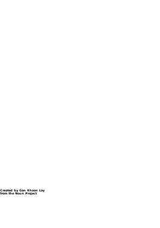

# Undercover Scrum Master

### Prior Operations

* Software development since 2009 (PO, BA, AO, etc.).
* Part-time Scrum Master starting in 2013.
* Full-time Scrum Master/Agile Coach from January 2016 until...
* Ruby developer on Scrum team starting August 2017.

### Mission Background

* Since discovering the Agile world, I've always been my team's Scrum Master or Agile Coach.
* I have always written scripts and queries to make my job easier, but hadn't contributed to a shared codebase.

### Mission Objective

Gain full-time experience writing production code on an Agile software developer team.

---

## Mission Debrief

1. Writing code = fun
2. Test infrasctructure != fun
3. Implicitly in a hurry
4. Cognitive load
5. Big picture paradox
6. "Pairing," pairing, and Pairing

---

## 1. Writing code = fun

Feedback loops are gratifying

Note:
Feedback loops:
* Seeing someone use the software
* Demoing to a stakeholder
* Tester approval
* Seeing the software work
* Getting automated tests to pass

### "Flow"

### Test-Driven Development

Note:
* Red -> Green -> Refactor feels _great_.

---

## 2. Test infrastructure   !=   fun

Note:
* Feels great when you're thinking about the production code.
* Feels like a waste when you're thinking about the tests.

### Creating & maintaining test _infrastructure_ is a necessary chore

Note:
* It's easier when it grows with the product
* Testing a simple function is simple
* Testing the whole application isn't bad, once you figure out your testing framework
* Tests in the middle are the messiest

### Tests get messy

* _Good_ tests lead to good tests
* _Bad_ or missing tests discourage tests
* _Ugly_ test doubles are a bramble

Note:
* Test doubles (mocks) help run tests more quickly (good) and with a narrower focus (also good)
* Test doubles requires knowing about how remote parts of the application work
* Figuring out the required test doubles for poorly-tested existing code is a royal pain
* Poorly tested code discourages new tests

---

## 3. Implicitly in a hurry

Unauthorized technical debt

### Velocity/Cycle Time

+++ Faster delivery

~ Enough discipline

? Code quality

Note:
* Of course we want to deliver more faster always
* POs and stakeholders only ask for more faster
* Quality only seems to matter when a defect escapes
* It's hard to communicate how code quality needs to be improved
* Writing high-quality code can end up being a matter of self-discipline with minimal support
* Advice I used to give: our standard is to do it the right way

### Antidote

Be explicit about technical debt

Note:
* Clearly communicate the team's commitment not to cut corners
* Shield the team from hurry-up talk
* Be very clear when an immediate band-aid is needed, to be followed later by a good fix
* Taking on technical debt should be rare and only when explicitly demanded in writing by the PO

---

## 4. Cognitive load

It's tiring

Note:
* So many tools, languages, & responsibilities
* Need to know business, technology, and process
* This load gets even worse in a "scaled" scenario

### So much to think about

•&nbsp;HTML •&nbsp;CSS •&nbsp;Javascript •&nbsp;React •&nbsp;Redux •&nbsp;Ruby •&nbsp;Rails •&nbsp;Redis •&nbsp;SQL •&nbsp;Sequel •&nbsp;Postgres •&nbsp;ESLint •&nbsp;Jest •&nbsp;Codecept •&nbsp;Cucumber •&nbsp;JMeter •&nbsp;RSwag •&nbsp;RSpec •&nbsp;Rubocop •&nbsp;VS&nbsp;Code •&nbsp;DataGrip •&nbsp;Bash •&nbsp;SSH •&nbsp;Oracle •&nbsp;OAuth2 •&nbsp;Swagger •&nbsp;Insomnia •&nbsp;Nginx •&nbsp;Regex •&nbsp;Slack •&nbsp;Outlook •&nbsp;SNow •&nbsp;Zoom •&nbsp;Git •&nbsp;GitHub •&nbsp;Jenkins •&nbsp;Docker •&nbsp;ECS •&nbsp;SQS •&nbsp;S3 •&nbsp;CI/CD&nbsp;Automation •&nbsp;Splunk •&nbsp;New&nbsp;Relic •&nbsp;Toggles •&nbsp;Cloudwatch •&nbsp;JIRA •&nbsp;Trello •&nbsp;Graphviz •&nbsp;Markdown •&nbsp;Kibana •&nbsp;Sidekiq •&nbsp;Elasticsearch

### Plus Plus!

* Applications themselves
* Partner applications
* Business needs
* Customer personas
* VIP stakeholders
* Team processes & ceremonies
* User Story and AC format

### Opportunity

Note:
* So much room for reducing the cognitive load

---

## 5. Big picture paradox

Can't live with it Can't live without it

### Conflicting Motivations

Gain context, avoid waste, and guide product

vs.

Have fun programming, minimize cognitive load, address urgent needs

Note:
* Need the big picture for executive decision-making
* Want early input to avoid bad path dependency
* Also want to focus on the work-at-hand (fun feedback loops)
* And want to reduce cognitive load

---

## 6. "Pairing," pairing, and Pairing

Note:
1. Working in close collaboration.
2. Only one person coding at a time, but driving for a _long_ time.
3. Actually switching off coding at same computer.

Note:
* How much time do you want to spend switching between drivers?

### Friction
1. Desk space
2. Hardware/software
3. Habits & intuition
4. Social comfort
5. Skill

Note:
* Full pairing takes infrastructure (hardware/screeshare) and courage
* Not intuitive and generally not comfortable
* Even close collaboration is a skill and not guaranteed to succeed

---

## Conclusion

Note:
* What would I do differently if I went back to being a Scrum Master tomorrow?
* What one take-away do I want folks to take away?
* How to sell developers on Pair Programming?
* Explain what Pair Programming is (Extreme Code Reviews)
* Business Value as developer. (Conflated with demo-able, UI, PO-testable)

Note:
1. Writing code = fun
2. Test infrasctructure != fun
3. Implicitly in a hurry
4. Cognitive load
5. Big picture paradox
6. "Pairing," pairing, and Pairing

---

## Bonus: the CSD

* CSM + three days of Agile engineering
* Hands-on TDD
* All about automated tests
* SOLID design principles
* Clean code
* A little about pairing