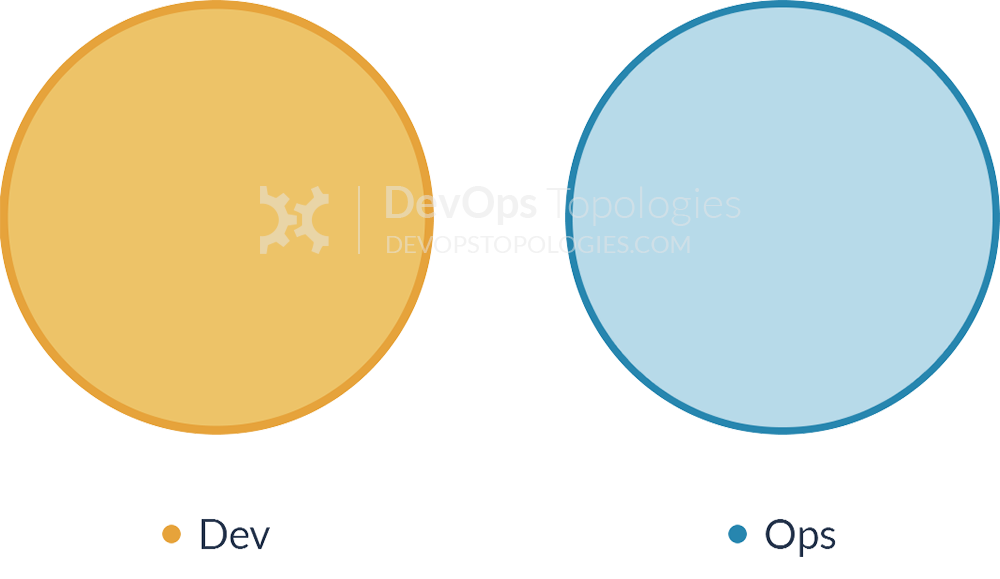

# Five Ideals of DevOps

Note:
- Dane Weber
- AgileDC on 2023-10-23

From Gene Kim's _The Unicorn Project_

## DevOps

Note:
Before we start, what is DevOps?

[The ability to automate the testing and deployment of AWS infrastructure and applications.](https://aws.amazon.com/certification/certified-devops-engineer-professional/)

⁉️

Note:
To a lot of folks now, DevOps is just about cloud-hosting and deployment automation.

Original Dev & Ops anti&#8209;pattern:

Anti-Type A

Note:
DevOps was a reaction to the Dev & Ops silos where developers focused on making changes that worked on their machines and Ops was focused on preventing changes from affecting the running system. Failures led to finger-pointing and blaming the others.

Main DevOps pattern:

Type 1

[DevOps Topologies](https://web.devopstopologies.com/)

Note:
- The idea behind the name "DevOps" was to remove the boundary between the two disciplines and encourage the groups to collaborate toward a shared purpose.
- This wasn't just about Dev & Ops, but naming is hard.
- For example, security was part of the conversation from the beginning, but nowadays "DevSecOps" is trendy to indicate the importance of security.
- There are many other variations on the name, but the idea was always to break down silos and the "DevOps" name is a little unfortunate.

Note:
DevOps folks have been trying to distill down what is involved in successful organizations. Each of these graphics could have their own presentation.

DevOps is
> Better value.
> Sooner, Safer, Happier.

~ Jon Smart

Note:
I really like this distillation of what DevOps is about.

## Ideals 🧭

<ul class="fragment" style="list-style-type: none">
<li>🔭 Organization</li>
<li>🔎 Team</li>
<li>🔬 Individual & Machine</li>
</ul>

Note:
- As an ideal, I imagine these more like direction.
- We want to get closer to the ideal.
- There's no checkmark achieving it and we all know that the situations we're in are less than ideal.
- Each applies macro and micro

### Five Ideals

1. 🦠 Locality and Simplicity
2. 💧 Focus, Flow, and Joy
3. 🔪 Improvement of Daily Work
4. ⛑ Psychological Safety
5. 🔮 Customer Focus

Note:
- This is Gene Kim's consolidation of the ideals that effective organizations strive for.
- I really like these as lenses for focusing on different aspects of the work system.
- **These are presented as a response to what has come before: the default American corporation.**

## Not Ideal

Big financial institution

1. 🦠 Locality and Simplicity
2. 💧 Focus, Flow, and Joy
3. 🔪 Improvement of Daily&nbsp;Work
4. ⛑ Psychological Safety
5. 🔮 Customer Focus

<ol>
<li class="fragment" data-fragment-index="2">🧶 Many teams and systems involved</li>
<li class="fragment" data-fragment-index="4">🐘 Big risky deployments</li>
<li class="fragment" data-fragment-index="6">🔥 Too many fires to put out</li>
<li class="fragment" data-fragment-index="8">🤫 Avoid attention from superiors</li>
<li class="fragment" data-fragment-index="10">🙈 Implementing farmed-out requirements</li>
</ol>

Note:
- 🧶 Many teams; many systems; 30+ had to be coordinated to implement a change to the duration of a loan-type.
- 🐘 Every release was big and resulted in fire-fighting, urgent bugs, and emergency deployments.
- 🔥 There was explicitly no time to address tech debt because there were too many fires.
- 🤫 Decisions were often made based on what would get the least attention from superiors.
- 🙈 Dev teams were implementing farmed-out requirements with nearly no context.

## Taylor's Scientific Management

Note:
- While the dysfunctions in organizations often have many contributing factors, Taylorism underlies many of the ideals that these organizations are striving toward.
- Taylorism is often referenced as the evil we enlightened folks are trying to battle.

Note:
- Frederick Winslow Taylor started "scientific management" in the 1880s
- This management approach has been highly influential throughout American corporations.

Note:
- Taylor started in a steel mill.
- He timed workers in order to determine the quickest way to perform each task.
- He then instructed workers on the quickest and most productive way.
- He also paid workers extra to use the methods he prescribed.
- He introduced the idea that managers should do the thinking to find the best way to perform a job and the workers should focus solely on laboring as instructed.

✅ Positive legacy

- Experimenting and learning better ways to work.
- Investing in training.
- Aligning incentives and sharing profits with workers.

Note:
There are positive and negative aspects to the legacy of scientific management.

❌ Negative legacy

- Shutting off workers' brains.
- Micromanagement.
- Centralizing decision-making.
- Disempowering the doers.

Note:
Many modern management practices unwittingly trace their origins to Taylor's Scientific Management.

The **Five Ideals of DevOps** are traits observed in high-performing software development organizations.

🔮⛑🔪💧🦠

<ol>
<li value="5">🔮 Customer Focus</li>
<li value="4">⛑ Psychological Safety</li>
<li value="3">🔪 Improvement of Daily Work</li>
<li value="2">💧 Focus, Flow, and Joy</li>
<li value="1">🦠 Locality and Simplicity</li>
</ol>

Note:
- Gene Kim gave the five ideals in this order, but I'm going to present them in reverse.
- These are all in play at once. They're not a progression.
- In my imagination, though, I see Customer Focus as foundational, and the others building on that.

## 🔮 Customer Focus

There is nothing so useless as doing efficiently that which should not be done at all.

~ Peter F. Drucker

Dev 🟡⇒ ⇐🔵 Ops

Note:
Stereotypically, Developers want to introduce new features and Operators want to keep the system stable. Customers want both of these things (and more), so focusing on the customers helps unite the efforts.

### Alignment of Work with Purpose

<ul class="fragment" style="list-style-type: none">
<li>Accomplish the mission</li>
<ul class="fragment" style="list-style-type: none">
<li>↖By doing X</li>
<ul class="fragment" style="list-style-type: none">
<li>↖By doing Y</li>
<ul class="fragment" style="list-style-type: none">
<li>↖By doing Z</li>
<ul class="fragment" style="list-style-type: none">
<li>↖By writing this line of code</li>
</ul></ul></ul></ul></ul>

Note:
Ideally, we understand the connection between our work and how it makes someone's life better.

Note:
- This work might have been performed efficiently, but it was a waste.
- Are we really solving our customers' problems?
- Is this door now wheelchair-accessible? No.
- Understanding "why" could've cleared up misunderstandings with requirements.

<!-- .slide: data-transition="slide fade" -->
### User Story

As a [stakeholder] 
I want [capability] 
So that [purpose] 

Note:
- User stories are just a reminder to consider "who" is affected and "why" this thing is worthwhile.
- The important thing is communicating why, not the format.
- Ideally the builders understand the purpose so that they can better push back and propose alternatives.

<!-- .slide: data-transition="slide fade" -->
### Context

stakeholder 
capability 
purpose 

Note:
- User stories are just a reminder to consider "who" is affected and "why" this thing is worthwhile.
- The important thing is communicating why, not the format.
- Ideally the builders understand the purpose so that they can better push back and propose alternatives.

### 5) 🔮 Customer Focus

- Go learn what real customers/stakeholders need.
- Learn, communicate, and challenge the _why_.
- Metrics won't save you. See [Goodhart's Law](https://en.wikipedia.org/wiki/Goodhart%27s_law).
- This isn’t just a specialist’s job: we each need to understand the _why_ of what we are doing so that we can make good trade-offs.

Note:
- Advice for achieving this ideal.

## ⛑ Psychological Safety

Of the five key dynamics of effective teams that the researchers identified, psychological safety was by far the most important.

~ Google's [re:Work](https://rework.withgoogle.com/guides/understanding-team-effectiveness/steps/foster-psychological-safety/)

Note:
- This is the biggest predictor of an engineering team’s success at Google.

Dev 🟡⇒ ⇐🔵 Ops

Note:
Being on a team naturally tends toward loyalty to the team and hostility to those outside of the team. Stereotypically, Dev and Ops blame each other for failed deployments and refuse to admit fault. Psychological safety is important for their effective collaboration, but also for trying new ways of working.

### Korean Air Flight 801 (Airplane Crash)

Note:
- First, some history.
- Tragedy; 6 August 1997; 229 deaths; As always, there are many factors, including fatigue, training, outdated maps, and more.
- Caused by an error on the part of the captain.
- The black-box recording showed that the flight crew were aware of his mistake and could have saved everyone, but were too afraid or deferential to challenge him or take over control.
- The flight crew suggested to the captain that he was making a mistake with his approach. They did not directly warn him.
- The first officer and flight engineer were required by policy to challenge the captain if concerned, but did not, even though they were concerned.
- The crew finally objected six seconds before the crash.
- The first officer had the ability to take over the controls and abort the landing, but allowed the captain to continue flying, even during the final six seconds.

### ⛑ Safety Culture ⛑

Don't be afraid to:

- Admit your limitations and mistakes.
- Speak up when you notice something.
- Challenge others, including managers, experts, and other senior personnel.

Note:
- The term "safety culture" came from an analysis of the Chernobyl disaster.
- It's important in high-stakes industries like nuclear power, oil drilling, airlines, shipping, spaceflight, etc.
- The motivation is to prevent disasters such as meltdowns, oil spills, crashes, etc.
- Software development is generally not at the same stakes.

### What about software development?

Note:
- We are social creatures, well-known going back to ancient philosophers.
- Social rejection is painful in the same way that physical pain is, as shown in [modern brain studies](https://www.apa.org/monitor/2012/04/rejection).
- The crew of Flight 801 knew they were in danger of dying, but were more afraid of the social consequences of speaking up.
- If they didn't speak up in that situation, why would you expect a manager or software developer to speak up when they notice a problem?

### Safe to Innovate 💡

Note:
If you can only speak up when you're 100% sure, we're going to miss out on a lot of great ideas.

> [Psychological safety](https://en.wikipedia.org/wiki/Psychological_safety) is being able to show and employ one's self without fear of negative consequences of self-image, status, or career.

Note:
Google studied their teams to find what ingredients led to effectiveness and high-performing teams. They found five main factors, one of which was psychological safety.

Google's [re:Work](https://rework.withgoogle.com/blog/five-keys-to-a-successful-google-team/)

> Taking a risk around your team members seems simple. But remember the last time you were working on a project. Did you feel like you could ask what the goal was without the risk of sounding like you’re the only one out of the loop?

> Or did you opt for continuing without clarifying anything, in order to avoid being perceived as someone who is unaware? Turns out, we’re all reluctant to engage in behaviors that could negatively influence how others perceive our competence, awareness, and positivity.

Advice from Google for achieving psychological safety:

- Frame the work as a learning problem, not an execution problem.
- Acknowledge your own fallibility.
- Model curiosity and ask lots of questions.

no disagreement ≠ safety

safety ⇒ constructive disagreement

### 4) ⛑ Psychological Safety

- Welcome new ideas.
- Challenge authority.
- Be vulnerable.
- Take risks without feeling insecure or embarrassed.
- Say, “I don’t know.” -- Continuously learning.
- Failure is done in the open, examined blamelessly, and leads to growth.

Note:
What psychological safety looks like and ideally what our work environment is like.

## 🔪 Improvement of Daily Work

There cannot be a more important thing for an engineer, for a product team, than to work on systems that drive our productivity.

So I would, any day of the week, trade off features for our own productivity.

I want our best engineers to work on our engineering systems, so that we can later on come back and build all of the new concepts we want.

~ Satya Nadella, CEO, Microsoft

Dev 🟡⇒ ⇐🔵 Ops

Note:
- The goal of DevOps is better "Better value. Sooner, Safer, Happier."
- There isn't "one true way" of developing, deploying, and operating, so you have to try things out and experiment with better solutions.
- DevOps is specifically challenging "the way it's always been done," and this ideal speaks directly to that.

### Andon Cord

Note:
- Toyota's legendary productivity, quality, and profitability is in part due to a culture where workers stop the assembly line to fix and improve, even though this costs over $15k per minute.
- There's a great story about this from Toyota taking over a failed GM factory in the 1980's.

- 1980's NUMMI story: Toyota turning GM's worst workforce around to produce cars with the fewest defects and considerable cost savings.
- Old rule: never stop the line. It cost the company $15k per minute when the line was stopped. People would fall into a pit or have a heart attack and the line would keep running; the people had to wait.
- Stop the line and fix a problem. ~1000 per shift; ~10% stop the line more than 30 seconds; ~1/month stop the line for over an hour ($1 million).

### Retrospectives

Inspect and adapt _everything_.

❤️

Note:
- As a Scrum Master or Agile Coach, Retrospectives were the most important activity to me.
- If you're unfamiliar, these meetings can take many different shapes. There are cool sites like Retromat and books devoted to retrospectives. The essential idea is to examine how things have gone, learn from that, and come up with actions for improvement.

### Experimentation

Taylorism's "Scientific Management" succeeded because its core insight was experimentation: try different ways and learn which is better.

Note:
Making changes you're sure will succeed will probably help you climb to the local maximum. It might be more of a leap to achieve an even better design. I'm not just talking about a block of code or website, but also teamwork approaches, HR policies, org structure, etc.

Note:
- The diagonal divide is between a "success" where the intended outcome occurred, and "failure" where it did not.
- If we only do the things we're nearly guaranteed to succeed, then we will learn very little.

### 3) 🔪 Improvement of Daily Work

- Improving how we work is more important than just doing the work.
- Stop the production line and make things better.
- Improve as individual people; improve relationships; improve processes; improve tools; improve technology.
- Reduce technical impediments and risks (tech debt) by investing in technical excellence.

Note:
Ideally we invest in improvements now so that they pay off not later.

## 💧 Focus, Flow, and Joy

In product development, our greatest waste is not unproductive engineers, but work products sitting idle in process queues.

~ Donald G. Reinertsen, _The Principles of Product Development Flow: Second Generation Lean Product Development_

Dev 🟡⇒ ⇐🔵 Ops

Note:
The 💧 flow of value is perhaps the most obvious ideal of DevOps with code changes rapidly passing through CI and CD to get out to production.

Note:
- When you map out the development process, you find that the vast majority of the cycle time is made of delays.
- This is fractal: as you dig down you find many tiny delays within what is an overall value-adding activity, such as the time it takes to rebuild the code or the time spent on a dead-end.

Note:
- from page 65 of "The Bottleneck Rules" by Clarke Ching
- "The testers can't keep up with the rest of the team."
- Everybody is working as fast and efficiently as possible.
- Items are sitting on the testing board for ages before being tested. When they are, they've gone stale, developers have forgotten what was involved, and they ask the testers a bunch of questions about the defects.
- The solution ended up involved slowing down everyone else to help the testers with the environments, answering their questions, and addressing defects immediately.

### Lean + Agile + DevOps

➡️ Flow ➡️

- Frequent
- Small batches
- Quickly

Note:
- Frequent integration, testing, and deployment.
- Small batches rapidly iterated upon.
- Value stream flow rather than resource utilization.

### Lead & Cycle Time

Lead Time

Normal lead time: the time between requesting a change and knowing that it is working correctly and being used.

Lead Time

Design & Definition

Development & Integration

Build, Test, & Deploy

Observed in Production

The lead time is composed of the cycle time for various steps in the flow.

Note:
There are many ways to reduce the cycle time for the various steps while maintaining or increasing quality and safety.

Design & Definition

Development & Integration

Build, Test, & Deploy

Observed in Production

<ul style="font-size: 50%">
<li>Three Amigos definition</li>
<li>Business working with development</li>
<li>User Stories and Acceptance Criteria</li>
<li>Specification by Example</li>
</ul>

<ul style="font-size: 50%">
<li>Pair-programming & Mob-programming</li>
<li>Clean code without repetition</li>
<li>Test-first</li>
<li>Low-latency, high-relevance tests</li>
<li>De-coupled services</li>
<li>Trunk-based development</li>
<li>Continuous integration</li>
</ul>

<ul style="font-size: 50%">
<li>CI/CD pipeline</li>
<li>Automated build</li>
<li>Automated test suites</li>
<li>Automated acceptance tests</li>
<li>Infrastructure as Code</li>
<li>Automated, containerized deployment</li>
<li>Blue/green deployments</li>
</ul>

<ul style="font-size: 50%">
<li>Smoke tests</li>
<li>Logging</li>
<li>Monitoring</li>
<li>Alerting</li>
<li>Reporting</li>
<li>A/B testing</li>
</ul>

### Developer Experience

Optimize for the time from start to confidently making meaningful changes.

Note:
- This is a big contributor to my joy as a developer and helps me focus.
- While much of this is most helpful to someone joining a project, it also helps those already familiar by reducing their mental load.
- The ideal is instantaneous.

### 2) 💧 Focus, Flow, and Joy

- Work within the problem-space, rather than with tangential matters that get in the way.
- Rapidly go from idea to a change in production.
- Have a great time doing so.
- Automate routine activities.
- Get rapid feedback on work.

## 🦠 Locality and Simplicity

Order can emerge from the bottom up, as opposed to being directed, with a plan, from the top down.

~ General Stanley McChrystal, U.S. Army, Retired, _Team of Teams_

Note:
- Great story about learning how to fight the war in Iraq.
- While the US military had grown toward strict hierarchy and siloing of information, that was disastrous for the US response to Al Qaeda in Iraq.
- If even the US military is learning to trust its people, we probably should too.

Dev 🟡⇒ ⇐🔵 Ops

Note:
The bad old way of doing things was to minimize deployments, which led to huge changesets, which is very risky, which leads to complex and bureaucratic phase-gates, sign-offs, and go/no-go meetings. The DevOps thing is aimed as simplifying and letting a small set of people accomplish meaningful things.

### Locality

(decoupled, disentangled, independent, etc.)

In software engineering, two components are **connascent** if a change in one would require the other to be modified in order to maintain the overall correctness of the system.

Note:
> Locality relates to the degree of which a development team can make local code changes in a location as opposed to many places, without impacting various teams and other locations. If a team needs to schedule a deployment and it requires 40 to 50 other teams to work with them into the schedule, nothing will ever get done. And if a team delivering on a single feature has to coordinate with 2 or many other development teams, it only creates delays and challenges for all of these teams. That’s the notion of locality.

### Simplicity

the art of maximising the amount of work not done

Note:
From the Agile Manifesto

Note:
- When asked to make the roof plate stable, most people think to add more supports, and only choose to remove the lone support when reminded that subtraction is an option.
- Human nature tends toward addition rather than subtraction, for many good reasons.
- This generally leads to increasing complexity and bureaucracy over time and especially as an organization or codebase grows.

### Hackman's Law

> The larger a group, the more process problems members encounter in carrying out their collective work… Worse, the vulnerability of a group to such difficulties increases sharply as size increases.

~ _The Psychology of Leadership: New Perspectives and Research_ [p. 131](https://books.google.co.in/books?id=6Sh5AgAAQBAJ&pg=PA131&lpg=PA131&dq=%22The+larger+a+group,+the+more+process+problems+members+encounter+in+carrying+out+their+collective+work%22&source=bl&ots=QU0HJyKXQQ&sig=XmRwVfYHLVOah3mr69vhozxBVVQ&hl=en&sa=X&ei=XeUiVNTpIoqryASM2IHACQ&redir_esc=y)

### [Diseconomies of Scale](https://en.wikipedia.org/wiki/Diseconomies_of_scale)

complexity

⬇️

risk + waste

Note:
- Reduce complexity to reduce risk and waste.
- The ideal is to be as simple and local as feasible.

### Conway's Law

> Any organization that designs a system (defined broadly) will produce a design whose structure is a copy of the organization's communication structure.

~Melvin E. Conway

Ref: [Wikipedia](https://en.wikipedia.org/wiki/Conway%27s_law) & [Mel Conway's site](http://melconway.com/Home/Conways_Law.html)

Note:
Move toward an organizational shape and software architecture that best aligns with the mission and serves your customers and stakeholders.

Note:
As I understand the origin and value of microservices, it is as a way to structure teams and their code to accomplish their work simply and locally.

### Value Delivery

1. Teams—Ideally a single team can deliver business value by itself, avoiding hand-offs, bottlenecks, and coordination overhead. (cross-functional feature teams…)
2. Code—Ideally the change can be made in a single place, avoiding repetition, dependencies, and unfamiliar code. (DRY, decoupled, well-architected code…)

### Operations and Maintenance

1. Teams—Ideally a team owns a service and can rewrite it on their own authority, avoiding committees and campaigning. (internal APIs, microservices…)
2. Code—Ideally there is a single version of the code running everywhere, avoiding merge conflicts, incompatibilities, and environment-specific issues. (continuous integration, trunk-based development, continuous delivery/deployment, etc.)

### 1) 🦠 Locality and Simplicity

- Minimize hand-offs, bottlenecks, and coordination with congruent architecture and organization.
- Empower the doers to act directly based on shared purpose and understanding.
- Applies to organizational structure, code organization, and data movement.
- Reduce complexity to reduce risk and waste.

## Five Ideals of DevOps

### Five Ideals

1. 🦠 [Locality and Simplicity](../LocalityAndSimplicity/LocalityAndSimplicity.html#/2)
2. 💧 [Focus, Flow, and Joy](../FocusFlowAndJoy/FocusFlowAndJoy.html#/2)
3. 🔪 [Improvement of Daily Work](../ImprovementOfDailyWork/ImprovementOfDailyWork.html#/2)
4. ⛑ [Psychological Safety](../PsychologicalSafety/PsychologicalSafety.html#/2)
5. 🔮 [Customer Focus](../CustomerFocus/CustomerFocus.html#/2)

Note:
- While there are plenty of other things I care about in organizations, these five ideals strike me as a great set.
- Could these inform "the Substantial way"?

Gene Kim's _Unicorn Project_

Note:
DevOps is
> Better value.
> Sooner, Safer, Happier.
~ Jon Smart
