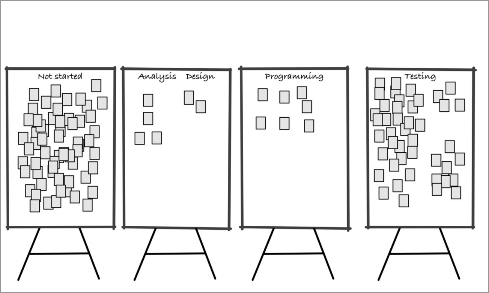
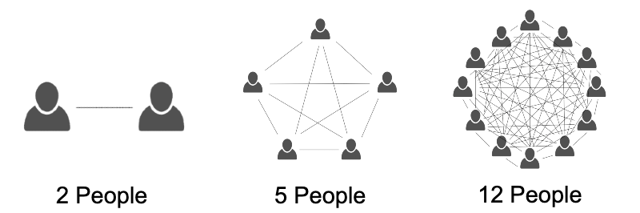

# Five Ideals of DevOps

From Gene Kim's _The Unicorn Project_

## Taylor's Scientific Management

Note:
- Frederick Winslow Taylor started "scientific management" in the 1880s
- This management approach has been highly influential throughout American corporations.

Note:
- Taylor started in a steel mill. He timed workers and instructed and paid workers to use the methods that were the most productive and efficient.
- He introduced the idea that managers should do the thinking to find the best way to perform a job and the workers should focus solely laboring as instructed.

✅ Positive legacy

- Experimenting and learning better ways to work.
- Investing in training.
- Aligning incentives and sharing profits with workers.

Note:
There are positive and negative aspects to the legacy of scientific management.

❌ Negative legacy

- Shutting off workers' brains.
- Micromanagement.
- Centralizing decision-making.
- Disempowering the doers.

Note:
Many modern management practices unwittingly trace their origins to Taylor's Scientific Management.

The **Five Ideals of DevOps** are traits observed in high-performing software development organizations.

🔮⛑🔪🎯🦠

## 🔮 Customer Focus

“There is nothing so useless as doing efficiently that which should not be done at all.”

~ Peter F. Drucker

### Alignment of Work with Purpose

- Accomplish the mission
  - ↖By doing X
    - ↖By doing Y
      - ↖By doing Z
        - ↖By writing this line of code

Note:
- Are we really solving our customers' problems?
- Is this door now wheelchair-accessible? No.

Acceptance Criteria:

- Ramp has 5 degree incline.
- Ramp is 36 inches wide.
- Ramp rises to height of the base of the door.
- Five steps from floor to base of the door.
- Each step has no more than a 7.2 inches rise.
- Each step is at least 10 inches deep.
- Each step is 36 inches wide.

Note:
These acceptance criteria might seem to ensure we'll get a good solution, but they're all satisfied by this inaccessible thing.

### User Story

As a [stakeholder] 
I want [capability] 
So that [the purpose] 

Note:
- User stories are just a reminder to consider "who" is affected and "why" this thing is worthwhile.
- The important thing is communicating why, not the format.

### [Goodhart's Law](https://en.wikipedia.org/wiki/Goodhart%27s_law)

When a measure becomes a target, it ceases to be a good measure.

~ [Marilyn Strathern](https://archive.org/details/ImprovingRatingsAuditInTheBritishUniversitySystem)

### 5) 🔮 Customer Focus

- Go learn what real customers/stakeholders need.
- Learn, communicate, and challenge the _why_.
- Prioritize core over context, which means doing the things that provide the real value.
- This isn’t just a specialist’s job: we each need to understand the _why_ of what we are doing so that we can make good trade-offs.

Note:
Everyone should learn what our customers really need.

## ⛑ Psychological Safety

> Of the five key dynamics of effective teams that the researchers identified, psychological safety was by far the most important.

Google's [re:Work](https://rework.withgoogle.com/guides/understanding-team-effectiveness/steps/foster-psychological-safety/)

Note:
- This is the biggest predictor of an engineering team’s success at Google.

### Korean Air Flight 801 (Airplane Crash)

Note:
- Tragedy caused by an error on the part of the captain. The black-box recording showed that the flight crew were aware of his mistake and could have saved everyone, but were too afraid or deferential to challenge him or take over control.

- Tragedy; 6 August 1997; 229 deaths; As always, there are many factors, including fatigue, training, outdated maps, and more.
- The flight crew suggested to the captain that he was making a mistake with his approach. They did not directly warn him.
- The first officer and flight engineer were required to challenge the captain if concerned, but did not, even though they were concerned.
- The crew finally objected six seconds before the crash.
- The first officer had the ability to take over the controls and abort the landing, but allowed the captain to continue flying, even during the final six seconds.

### ⛑ Safety Culture ⛑

Don't be afraid to:

- Admit your limitations and mistakes.
- Speak up when you notice something.
- Challenge others, including managers, experts, and other senior personnel.

Note:
The term "safety culture" came from an analysis of the Chernobyl disaster.

### Fully Engaged Brains

<ul>
<li>⛏️ Digging a ditch with shovels: we need your muscles. 💪</li>
<li class="fragment">⌨ Data entry: we need your eyes or ears and your fingers. 🖐</li>
<li class="fragment">👩‍💻 Software development: we need your brains. 🧠</li>
</ul>

In software development, what if we have to do the same thing again?

Copy Paste 📋

⚙ We automate routine work.

We are engaged in creative problem-solving.

You can still help ⛏ dig a ditch while you're zoned out and letting your mind wander. 🦄

You might be able to continue ⌨ data entry while thinking about other things. 🚀

👩‍💻 Writing specs, coding a solution, reading error logs, and helping with nearly any system development activity requires engaging your brain. 🧐

Psychological safety is critical in order to contribute effectively to creative problem-solving.

Note:
People must be
- mentally engaged
- motivated
- safe to provide their insights, suggestions, and ideas

### 4) ⛑ Psychological Safety

- Challenge authority.
- Take risks without feeling insecure or embarrassed.
- Say, “I don’t know.” -- Continuously learning.
- Welcome new ideas.
- Failure is done in the open, examined blamelessly, and leads to growth.

## 🔪 Improvement of Daily Work

“There cannot be a more important thing for an engineer, for a product team, than to work on systems that drive our productivity.”

“So I would, any day of the week, trade off features for our own productivity.”

“I want our best engineers to work on our engineering systems, so that we can later on come back and build all of the new concepts we want.”

~ Satya Nadella, CEO, Microsoft

### Andon Cord

Note:
- Toyota's legendary productivity, quality, and profitability is in part due to a culture where workers stop the assembly line to fix and improve, even though this costs over $15k per minute.
- There's a great story about this from Toyota taking over a failed GM factory in the 1980's.

- 1980's NUMMI story: Toyota turning GM's worst workforce around to produce cars with the fewest defects and considerable cost savings.
- Old rule: never stop the line. It cost the company $15k per minute when the line was stopped. People would fall into a pit or have a heart attack and the line would keep running; the people had to wait.
- Stop the line and fix a problem. ~1000 per shift; ~10% stop the line more than 30 seconds; ~1/month stop the line for over an hour ($1 million).

### Retrospectives

Inspect and adapt _everything_.

Note:
- As a Scrum Master or Agile Coach, Retrospectives were the most important activity to me.
- If you're unfamiliar, these meetings can take many different shapes. There are cool sites like Retromat and books devoted retrospectives. The essential idea is to examine how things have gone, learn from that, and come up with actions for improvement.

### Experimentation

Taylorism's "Scientific Management" succeeded because its core insight was experimentation: try different ways and learn which is better.

Note:
Making changes you're sure will succeed will probably help you climb to the local maximum. It might be more of a leap to achieve an even better design. I'm not just talking about a block of code or website, but also teamwork approaches, HR policies, org structure, etc.

Note:
- The diagonal divide is between a "success" where the intended outcome occurred, and "failure" where it did not.
- If we only do the things we're nearly guaranteed to succeed, then we will learn very little.

### 3) 🔪 Improvement of Daily Work

- Improving how we work is more important than just doing the work.
- Stop the production line and make things better.
- Improve as individual people; improve relationships; improve processes; improve tools; improve technology.
- Reduce technical impediments and risks by investing in technical excellence.

Note:
Invest in improvements now, not later.

## 🎯 Focus, Flow, and Joy

“In product development, our greatest waste is not unproductive engineers, but work products sitting idle in process queues.”

~ Donald G. Reinertsen, _The Principles of Product Development Flow: Second Generation Lean Product Development_

Note:
- When you map out the development process, you find that the vast majority of the cycle time is made of delays.
- This is fractal: as you dig down you find many tiny delays within what is an overall value-adding activity, such as the time it takes to rebuild the code or the time spent on a dead-end.

Note:
- from page 65 of "The Bottleneck Rules" by Clarke Ching
- "The testers can't keep up with the rest of the team."
- Everybody is working as fast and efficiently as possible.
- Items are sitting on the testing board for ages before being tested. When they are, they've gone stale, developers have forgotten what was involved, and they ask the testers a bunch of questions about the defects.
- The solution ended up involved slowing down everyone else to help the testers with the environments, answering their questions, and addressing defects immediately.

### Lean + Agile + DevOps

Note:
- Value stream flow rather than individual productivity.
- Small batches rapidly iterated upon.
- Frequent integration, testing, and deployment.

### Lead & Cycle Time

Lead Time

Normal lead time: the time between requesting a change and knowing that it is working correctly and being used.

Lead Time

Design & Definition

Development & Integration

Build, Test, & Deploy

Observed in Production

The lead time is composed of the cycle time for various steps in the flow.

There are many ways to reduce the cycle time for the various steps while maintaining or increasing quality and safety.

Design & Definition

Development & Integration

Build, Test, & Deploy

Observed in Production

- Three Amigos definition
- Business working with development
- User Stories and Acceptance Criteria
- Specification by Example

- Pair-programming & Mob-programming
- Clean code without repetition
- Test-first
- Low-latency, high-relevance tests
- De-coupled services
- Trunk-based development
- Continuous integration

- CI/CD pipeline
- Automated build
- Automated test suites
- Automated acceptance tests
- Infrastructure as Code
- Automated, containerized deployment
- Blue/green deployments

- Smoke tests
- Logging
- Monitoring
- Alerting
- Reporting
- A/B testing

### Developer Experience

Optimize for the time from start to confidently making meaningful changes.

Note:
- This is a big contributor to my joy as a developer and helps me focus.
- While much of this is most helpful to someone joining a project, it also helps those already familiar by reducing their mental load.
- Hardware and tools
- Local setup
- Reading and understanding the code
- Observing system behavior

### 2) 🎯 Focus, Flow, and Joy

- Work within the problem-space, rather than with tangential matters that get in the way.
- Rapidly go from idea to a change in production.
- Have a great time doing so.
- Automate routine activities.
- Get rapid feedback on work.

## 🦠 Locality and Simplicity

Note:
- Scaling manifesto. First two principles: don't scale.
- Conway's Law

“Order can emerge from the bottom up, as opposed to being directed, with a plan, from the top down.”

~ General Stanley McChrystal, U.S. Army, Retired, _Team of Teams_

Note:
- Great story about learning how to fight the war in Iraq.
- While the US military had grown toward strict hierarchy and siloing of information, that was disastrous for the US response to Al Qaeda in Iraq.
- If even the US military is learning to trust its people, we probably should too.

Note:
- When asked to make the roof plate stable, most people think to add more supports, and only choose to remove the lone support when reminded that subtraction is an option.
- Human nature tends toward addition rather than subtraction, for many good reaons.
- This generally leads to increasing complexity and bureaucracy over time and especially as an organization or codebase grows.

### Conway's Law

> Any organization that designs a system (defined broadly) will produce a design whose structure is a copy of the organization's communication structure.

~Melvin E. Conway

Ref: [Wikipedia](https://en.wikipedia.org/wiki/Conway%27s_law) & [Mel Conway's site](http://melconway.com/Home/Conways_Law.html)

Note:
Move toward an organizational shape and software architecture that best aligns with the mission and serves your customers and stakeholders.

### Hackman's Law

> The larger a group, the more process problems members encounter in carrying out their collective work… Worse, the vulnerability of a group to such difficulties increases sharply as size increases.

~ _The Psychology of Leadership: New Perspectives and Research_ [p. 131](https://books.google.co.in/books?id=6Sh5AgAAQBAJ&pg=PA131&lpg=PA131&dq=%22The+larger+a+group,+the+more+process+problems+members+encounter+in+carrying+out+their+collective+work%22&source=bl&ots=QU0HJyKXQQ&sig=XmRwVfYHLVOah3mr69vhozxBVVQ&hl=en&sa=X&ei=XeUiVNTpIoqryASM2IHACQ&redir_esc=y)

### [Diseconomies of Scale](https://en.wikipedia.org/wiki/Diseconomies_of_scale)

Avoid scaling if possible. See the first two principles of the [Manifesto for Scaling Agility](https://scalingmanifesto.org/):

1. If you can achieve your goals with a single team, <em style="color: yellow">do&nbsp;not&nbsp;scale</em>. Employ the minimum number of people required to meet your strategic outcomes.
2. If you have a single team and it cannot deliver effectively using Agile principles and practices, <em style="color: yellow">do&nbsp;not&nbsp;scale</em>. Succeed with a single team first.

## Reduce complexity to reduce risk and waste

### Value Delivery

1. Teams—Ideally a single team can deliver business value by itself, avoiding hand-offs, bottlenecks, and coordination overhead. (cross-functional feature teams…)
2. Code—Ideally the change can be made in a single place, avoiding repetition, dependencies, and unfamiliar code. (DRY, decoupled, well-architected code…)

### Operations and Maintenance

1. Teams—Ideally a team owns a service and can rewrite it on their own authority, avoiding committees and campaigning. (internal APIs, microservices…)
2. Code—Ideally there is a single version of the code running everywhere, avoiding merge conflicts, incompatibilities, and environment-specific issues. (continuous integration, trunk-based development, continuous delivery/deployment, etc.)

### 1) 🦠 Locality and Simplicity

- Minimize hand-offs, bottlenecks, and coordination with congruent architecture and organization.
- Empower the doers to act directly based on shared purpose and understanding.
- Applies to organizational structure, code organization, and data movement.
- Reduce complexity to reduce risk and waste.

## Five Ideals of DevOps

Gene Kim's _Unicorn Project_

Note:
DevOps is
> Better value.
> Sooner, Safer, Happier.

~ Jon Smart

### Five Ideals

1. 🦠 [Locality and Simplicity](../LocalityAndSimplicity/LocalityAndSimplicity.html#/2)
2. 🎯 [Focus, Flow, and Joy](../FocusFlowAndJoy/FocusFlowAndJoy.html#/2)
3. 🔪 [Improvement of Daily Work](../ImprovementOfDailyWork/ImprovementOfDailyWork.html#/2)
4. ⛑ [Psychological Safety](../PsychologicalSafety/PsychologicalSafety.html#/2)
5. 🔮 [Customer Focus](../CustomerFocus/CustomerFocus.html#/2)

Note:
🔬 Lenses for focusing on different aspects of the work system.

They apply to various levels: micro to macro. 🔭